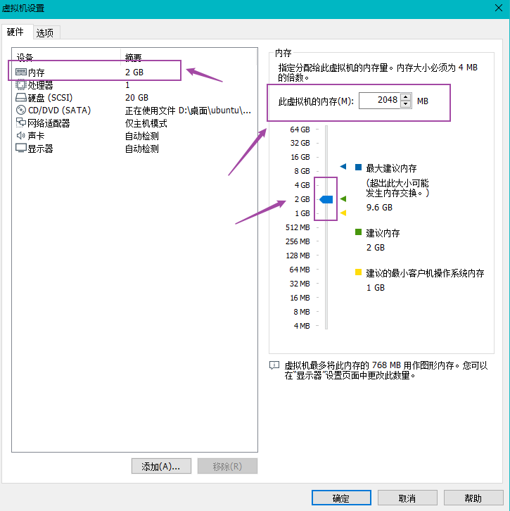

<!-- TOC -->

- [1. 极其简单方法安装Windows虚拟机 + Ubuntu + 修复Ubuntu小问题](#1-%e6%9e%81%e5%85%b6%e7%ae%80%e5%8d%95%e6%96%b9%e6%b3%95%e5%ae%89%e8%a3%85windows%e8%99%9a%e6%8b%9f%e6%9c%ba--ubuntu--%e4%bf%ae%e5%a4%8dubuntu%e5%b0%8f%e9%97%ae%e9%a2%98)
  - [1.1. 安装Windows虚拟机 + Ubuntu](#11-%e5%ae%89%e8%a3%85windows%e8%99%9a%e6%8b%9f%e6%9c%ba--ubuntu)
    - [1.1.1. VMware 15虚拟机安装教程](#111-vmware-15%e8%99%9a%e6%8b%9f%e6%9c%ba%e5%ae%89%e8%a3%85%e6%95%99%e7%a8%8b)
    - [1.1.2. 在虚拟机安装Linux Ubuntu教程](#112-%e5%9c%a8%e8%99%9a%e6%8b%9f%e6%9c%ba%e5%ae%89%e8%a3%85linux-ubuntu%e6%95%99%e7%a8%8b)
    - [修复Ubuntu出现的小问题](#%e4%bf%ae%e5%a4%8dubuntu%e5%87%ba%e7%8e%b0%e7%9a%84%e5%b0%8f%e9%97%ae%e9%a2%98)

<!-- /TOC -->

# 1. 极其简单方法安装Windows虚拟机 + Ubuntu + 修复Ubuntu小问题

## 1.1. 安装Windows虚拟机 + Ubuntu

### 1.1.1. VMware 15虚拟机安装教程

注：前人的教程已经特别好了，故这里仅仅贴出前人的安装教程，亲测有效，无坑~【来源：软件安装管家公众号】  
[VMware 15虚拟机安装教程](https://mp.weixin.qq.com/s?__biz=MzIwMjE1MjMyMw==&mid=2650202647&idx=1&sn=f77b906ab29fa217135d7903cb32b075&chksm=8ee142fbb996cbeda2e6f08ea18bec97f4d5c57596e04b2a5dc88894389b06aca1a698afd065&mpshare=1&scene=1&srcid=0820VTDc4qoBshffdgMqRvn0&sharer_sharetime=1566263691846&sharer_shareid=1bfcc99ef12aaea8b1dde0097af37dff&key=c15442729400cc6aec3a682558e60dd9d680780e1a8d166c40a9448776a37cc82bf7df0e9dff8d0dbbf46b90eec250a743ea22b34c34e61919f2d0fa32d5e32af51a686448d618a3d556e7962929404a&ascene=1&uin=OTg4ODk0OTA5&devicetype=Windows+10&version=62060833&lang=zh_CN&pass_ticket=AH5viea3W6NT9vbwcA%2FmvePYJ6DpAkG%2B2jFks8VRNorDiRWoPGrRnh%2B1XC4PZe%2FX)  

### 1.1.2. 在虚拟机安装Linux Ubuntu教程

注：前人的教程已经特别好了，故这里仅仅贴出前人的安装教程，亲测有效，无坑~【来源：软件安装管家公众号】    
[Linux Ubuntu安装教程](https://mp.weixin.qq.com/s?__biz=MzIwMjE1MjMyMw==&mid=2650199783&idx=1&sn=9043175abcff37ee4d839d7de7e2bfd6&chksm=8ee1760bb996ff1dfcd2020361d6333ca6300e83ffd65b828145adf28cc116618f55cb9fba6e&mpshare=1&scene=1&srcid=0820sbgR08PqS9rXiU0CKUJf&sharer_sharetime=1566263705281&sharer_shareid=1bfcc99ef12aaea8b1dde0097af37dff&key=ca8f8eea8958ab3db472507968b8039483fda91f861052a083d037af145d3d9c43924ff509257004ce3882ed58beb0e74b61acd7d63ff1a82da39cf1e94e715c88bacf73d01e3f999ba1f4622de893b0&ascene=1&uin=OTg4ODk0OTA5&devicetype=Windows+10&version=62060833&lang=zh_CN&pass_ticket=AH5viea3W6NT9vbwcA%2FmvePYJ6DpAkG%2B2jFks8VRNorDiRWoPGrRnh%2B1XC4PZe%2FX)

### 修复Ubuntu出现的小问题

**问题1：** Ubuntu界面只占VMware的一部分，Ubuntu内容显示不完全，出现的问题的效果如图：

  

**解决：**   
1. 出现该问题的原因为：Ubuntu在虚拟机中默认的分辨率为800*600，但是因为你的电脑的分辨率会高于这个分辨率，因此有一些内容就显示不了。
2. 解决的方式很简单，我们Ubuntu的分辨率就可以，具体的操作过程如下：

**问题2** 使用Ubuntu很卡顿，不流畅

**解决：**  
1. 出现这个问题的原因在于：我们没能好好处理虚拟机软件跟我们windows内存的关系，造成内存争抢，同时虚拟机软件的一些设置不能使我们的Ubuntu流畅运行。
2. 解决方式如下：

   - 给Ubuntu（虚拟机）的内存多少合适?
      - 有一个设置误区是：“虚拟机设置的内存和CPU越多越好”，其实CPU和内存的设置要结合自身电脑的配置来设置！不同的需求设置如下：
      - 情况一：需要使用虚拟机用于开发等大型应用时，就需要把虚拟机内存（但不能大于物理机(你开虚拟机的Windows系统)和CPU调高；同时物理机（你开虚拟机的Windows系统）上的应用就要尽可能地关闭，保持虚拟机地全速运行）
      - 情况二：在物理机（你自己的Windows系统）开发，虚拟机上只是用于测试（安装老版本浏览器，测试兼容等），这个时候你就要尽可能把虚拟机的相关配置设置到最小，因为你在虚拟上仅仅需要一个浏览器而已。（比如：win10 64位 12G内存的笔记本，我就只给了虚拟机2GB的运行内存，1个CPU）
      - 情况三：不用于开发，只是用于平常的娱乐（比如想安装一些软件试玩，但又不想安装在物理机上；安装一些有病毒的软件等等），总之就是：可以随便搞，搞出事了，删掉再重新安装一个虚拟机就可以了，就又是全新的系统。这个时候可以设置虚拟机和物理机内存各半，方便切换。
    - 选择“调整所有虚拟机内存使其适应预留的主机 RAM（F）”的原因和重要性？
      | 设置                                     | 描述                                                                                                                                                                                                            |
      | :--------------------------------------- | :-------------------------------------------------------------------------------------------------------------------------------------------------------------------------------------------------------------- |
      | 调整所有虚拟机内存使其适应预留的主机 RMA | 选择此选项会对给定时间内可以运行的虚拟机的数量和内存容量实施加以最严格的限制。在此设置下，由于虚拟机完全在RAM中运行，因此可能具有最佳的性能。                                                                   |
      | 允许交换部分虚拟机内存                   | 主机操作系统可以将适度的虚拟机内存交换到磁盘。选择此设置将允许虚拟机的数量和内存容量有所增加，以便他们可以在给定时间在主机系统中运行。  如果虚拟机内存必须在RAM和磁盘切换，此设置可能会导致性能下降。           |
      | 允许交换大部分虚拟机内存                 | 主机操作系统可以根据需要尽可能将虚拟机内存容量交换到磁盘。与允许交换部分虚拟机内存设置相比，选择此设置后，您将能够用更多的内存运行更多的虚拟机。  如果虚拟机内存必须在RAM和磁盘进行交换，此设置会导致性能降低。 |

  
   - 这里的设置跟上面的设置很像，区别在于：上面的设置类似于全局设置（你以后的虚拟机就是通过这样子创建的），下面的设置是针对你目前的虚拟机进行设置。
