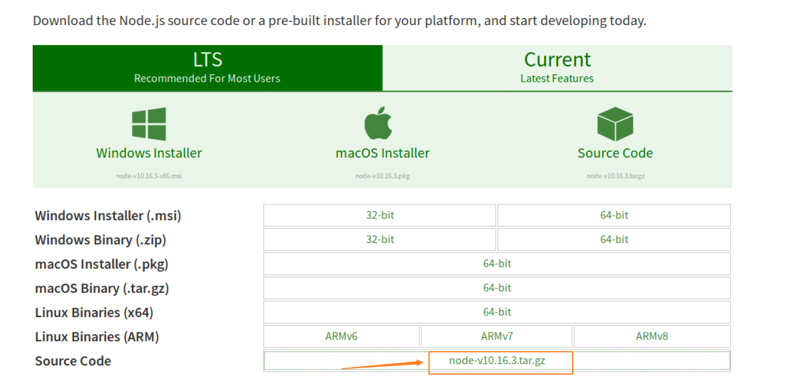
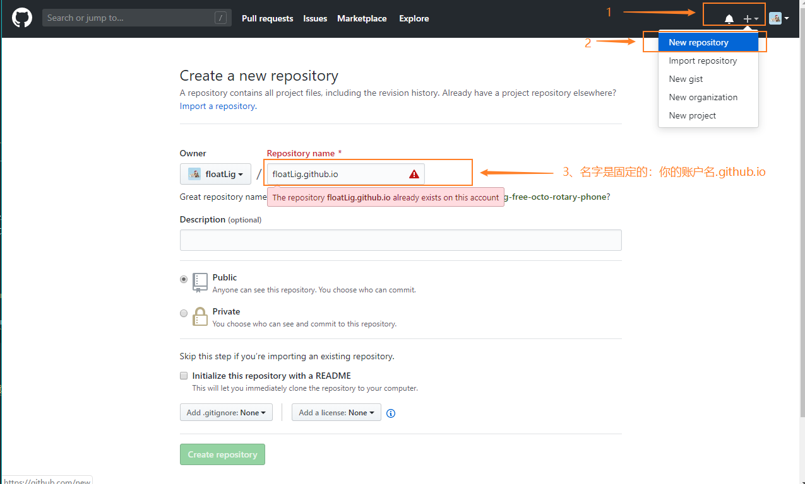
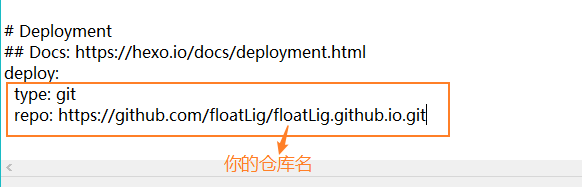
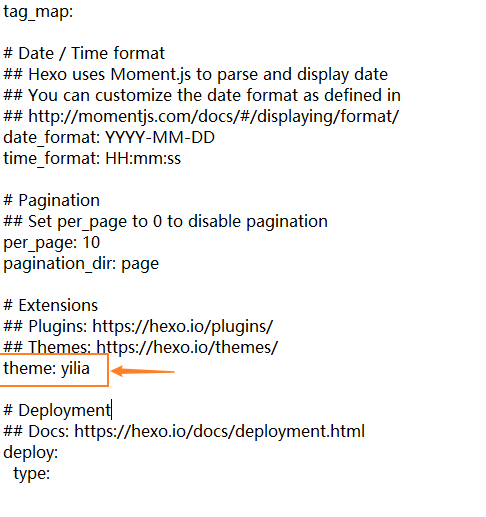
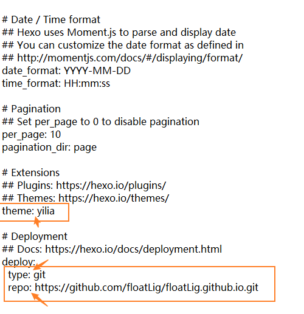

## 为什么要搭建自己的博客？

社招和校招，加分项会比较大点

搭建自己的博客的好处？

搭建自己博客如果出现了问题，把文件夹干掉再重来就可以
出现了问题，大不了从头再来

## 博客框架选择

hexo

比较成熟，解决方案很多。

## 


检查node js是否是否安装成功：  
> node -v  


## 部署环境

### 需要安装node.js  （通过源码编译安装，注：这种方法用的时间是在是太久了(っ °Д °;)っ）

1. 我们用root权限更新一下软件包管理器，输入下面命令后，再输入自己的root密码
    > sudo apt-get update  
2. 安装python，gcc,make,g++ ( 这一步需要下载的东西比较多，时间也会久一点，需要大概700M左右的流量 )
    > apt-get install python gcc make g++
3. 【建议不要按以下的方法装】然后接下来我们正式来安装node.js，首先我们来到[node.js官网的下载专区](https://nodejs.org/en/download/)，然后在下图中红框内，在标有Source Code上右键，复制下载链接

    

4. 然后执行下载的命令,(下图的地址为Source Code的下载地址，大家根据刚刚复制的地址，粘贴进去)
    > wget https://nodejs.org/dist/v10.16.3/node-v10.16.3.tar.gz 
5. 然后解压刚刚下载的Source Code
    > tar -zxvf node-v10.16.3.tar.gz
6. 进入到刚刚解压好的node-v10.16.3.tar.gz文件夹中
    > cd node-v10.16.3
7. 然后进行“检测平台安装环境”，“编译”，“执行安装” (这里的make,make install要巨久(っ °Д °;)っ)
    > ./configure
    > make
    > sudo make install
8. 上面的命令行跑完，node.js就安装好啦，这个时候我们来检验一下node.js是否安装好了
    > node -v  
    > npm -v
9. npm换淘宝的源cnpm，下载速度会快一点;
    > npm install -g cnpm --registry=https://registry.npm.taobao.org  
    > cnpm -v

### 安装git

1. > apt-get install git  
   > git --version

### 用cnpm安装hexo

1. -g意思为全局安装
   > cnpm install -g hexo-cli  
   > hexo -v

## 如何初始化个人博客

1. 启动博客 s:start
   > sudo hexo init     
   > （可能不需要）npm install hexo-server  
   > hexo s
2. 这个时候就可以在我们的浏览器打开hexo为我们生成的博客啦：http://localhost:4000/

## 如何写博客

1. > hexo n "我的第一篇博客.md"
2. markdown写完之后,g为generate
    > hexo clean  
    > hexo g  
    > hexo s

## 如何把个人博客部署到远端

1. 我们选择把博客部署到GitHub上面去，[注册登录Github](https://github.com/)
2. 新建一个io仓库，注意，仓库名的是唯一的，不能乱起。（因为我已经创建了，所以会显示警告）
   
3. 在blog所在的位置安装一个git的插件
    > cnpm install --save hexo-deployer-git
4. 然后需要在_config.yml增加一些属性
   
   

5. 这个时候就可以将它部署到远端啦
   > hexo d

## 如何给个人博客换主题

这里安装yilia的主题  
1. 把yilia主题clone到本地的 theme文件夹下的yilia文件夹中
   > clone https://github.com/litten/hexo-theme-yilia.git themes/yilia
2. 然后同样的需要在_config.yml修改一些配置（将theme设置为yilia）  

   

3. 然后clean一下，generate一下，最后deploy一下，推到远端
   > hexo clean
   > hexo g
   > hexo d

## 遇到的其他问题

#### 问题1：

npm 安装参数中的 --save是什么意思？  

#### 回答1：

当你为你的模块安装一个

#### 问题2：

hexo搭建博客过程中出现4000端口被占用

#### 解答2：

1. 一般情况下，4000端口被占用是因为你开了多个终端，或许你在另一个终端使用了4000端口，你目前正在编辑的终端也是用4000端口；解决方法为：关闭其中一个终端
2. 另一种解决方法为：使用新的端口打开Hexo，操作为在`_config.yml`内加上如下代码，从而更改hexo-server运行时的端口号：
   ```java
    server:
        port: 4001
        compress: true
        header: true
   ```

#### 问题3：can not read a block mapping entry; a multiline key may not be an implicit key at line 78, column 1:

#### 解答3：  

无法读取块映射条目；多行键可能不是隐式键；出现这种情况很有可能是修改_config.yml不规范造成的，你要很注意“：”后面有一个空格



#### 问题4：


#### 问题4/解答4：

在hexo init初始化中，出现git的一些错误，怎么解决都无济于事；最后重装了git就成功了

#### 问题5/解答5：  

在删除blog文件夹时，出现需要“××权限”才能删除，有可能是因为你vs code打开了它 (＃°Д°)

#### 问题6/解答6：

win + R，切换到D盘：
> D:

#### 体会

不要怕！有虚拟机！错了干掉重来！

1. 打命令行，慢一点，可以的
2. 写博客真的可以让自己体会更多！最后再做一个知识地图和总结，真的很完美！
3. 出现问题：看错误信息 --> 打印一些辅助信息 -->  Degug  --> 网上查


