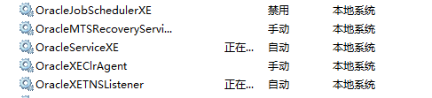
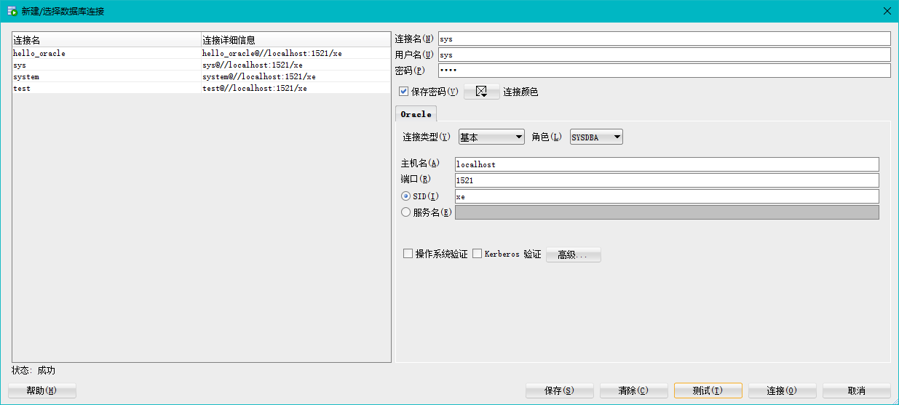

<!-- TOC -->
- [基本操作](#基本操作)
- [数据库操作](#数据库操作)
- [select](#SELECT：对这一项的具体输出)

## 基础知识

### 使用数据库的前期准备

1. 使用Oracle,需要打开两个服务（以Oracle 11g Express edition为例）,具体操作如下：
	- Windows操作系统中，使用快捷键Win+Q打开搜索栏，搜索“服务”
	- 在服务中找到以下两个服务后，右键启动
		- OracleXETNSListener
		- OracleServiceXE  
	
	**两个服务的作用：**

	OracleXETNSListener作用：Oracle监听器，监听用户的请求等等（如果有客户连接到数据库，这个功能必须得打开）【当被监听的对象发生变化时（某种请求），监听器的某个方法将会被立即执行】。  
	OracleServiceXE作用：数据库得主服务器，此服务启动才能启动Oracle。  



2. Oracle的第一行代码（以图形界面软件Oracle SQL developer为例）     
	- 新建sys管理员数据库连接  

	- 备注：如果你要创建新的用户，必须得通过sys系统管理员/system本地管理员才能新建其他用户，因为Oracle默认只有sys系统管理员/system本地管理员/Scott普通用户（默认不解锁） 

	**防止掉坑：**

	名词解释-端口  
		- 1-49151端口：依据互联网传输层TCP/IP协议的协议通信，不同的协议都对应不同的端口  
		- 1521 对应Oracle数据库default listener  
		
	在命令行界面（cmd）使用sqlplus遇到的问题  
		- Oracle乱码：客户端服务端的字符集设置不一样：  
		1、常用unicode字符集 set NLS_LANG=american_america.AL32UTF8 可以通过修改注册表键值永久设置 HKEY_LOCAL_MACHINE\SOFTWARE\ORACLE\HOMExx\NLS_LANG  
		2、常用中文字符集（一般不用） set NLS_LANG=SIMPLIFIED CHINESE_CHINA.ZHS16GBK   
  		3、需要注意的点：环境变量  

	注册表
		- 以后快速找到某个注册表：将注册表添加到收藏夹
		- 找注册表的值：模糊搜索：“HKEY_LOCAL_MACHINE\SOFTWARE\ORACLE\”（适时可以加‘/’）

### 数据库的上手代码

```mysql
/* 数据库的操作（Oracle的注释有两种/*和--和） */
--一开始的用户只有管理员:sys超级管理员，system本地管理员,（scott普通用户，默认不解锁）通过这两个管理员可以创建其他用户
--创建myDataBase用户;identified by后面是用户密码;
--刚创建的用户是没有任何权限，通过grant/revoke授予/收回用户的权限
--resource访问权限，访问表等；connect连接数据库;dba所有的权限;
create user myDataBase identified by uber;
grant resource,connect,unlimited tablespace,create view to myDataBase;

--dual表是实际存在的虚表，由sys创建，任何用户都可以读取
--可以通过该dual表查看"系统时间"，"显示当前用户"（和show user的作用一样）
select sysdate from dual;
select user from dual;
show user;

--查看所有的用户(只能sys/system管理员模式下查看)
select username from dba_users;

--提交/回滚
commit;
rollback;

--删除用户
drop user mydatabase;

```

### SELECT：对这一项的具体输出

```mysql
select [all|distinct] ** from ** where ** group by ** having ** order by **;
1、select
	--可以使用*表示所有字段
	select * from sudent;
	-- 可以使用表达式（计算公式、函数调用、字段也是个表达式）
	select 2019=sage,lower(sdept) from student;
	-- 可以为每个列使用别名。适用于简化列标志，避免多个列标识重复(出生年龄的引号可加可不加)
	select 2019-sage 出生年龄 from student;
	--名字拓展(注意是单引号' '||)
	select '年龄:'||sage from student;
2、from (**对表的连接，配合where/in**)  
（当涉及多个表时，以student，sc,course 总表的角度思考问题，一般使用自然连接（如果条件是sno/cno等相同值时），如果条件是需要比较的话，则一般采用“一般的连接”）  
 (使用in的优势：在select的内容只存在一张表中时，你使用in会更容易理解)  
（where拓展:左外连接（左边表的所有元组都会显示出来，右边表如果没有值则设置为null），自然连接（默认相等连接，省去where后面的student.sno=sc.sno），一般的连接（通过where判断相等））

	/* 表连接的两种常用的方式 */
	/* 自己的理解：使用笛卡尔积时，where后面必须跟笛卡尔积以什么的条件筛选（一般：student.sn0=sc.sno,可以将三个表连接起来，但是这样子使用select的时候，有重复列的sno,cno需要上student.sno ，没有重复列的sname则不用 ；） */
	/* 自己的理解：通常有三个表，学生表和课程表是基础表，还有一个类似函数的表（选修表）*/
	 
	--输出和刘晨同个系的所有学生的姓名
	--in
	select * from student where sdept in(select sdept from student where sname='刘晨');  
	--笛卡尔积
	select s2.* from student s1,student s2 where s1.sname='刘晨'and s1.sdept =s2.sdept;
	--输出选修了“信息系统”这门课所有学生的学号和姓名
	--in
	select student.cno,sname from student where sno in
	(selcet sno from sc where cno in (select cno from course where cname='信息系统') );
	--笛卡尔积
	select student.sno,sname from student,sc,course where sno from student.sno=sc.sno and sc.cno=course.con and cname='信息系统';
	--输出课程号，关于这门课的成绩大于该学生的平均成绩（注意，这里内表必须：sc2.sno=sc1.sno）
	select cno from sc sc1 where grade>(select avg(grade)from sc sc2 where sc2.sno=sc1.sno);
	
	/* 左外连接，自然连接 */
	--左外连接（会有null）
	select  stuent.sno.cno.grade from student left outer join sc on student.sno=sc.sco (不会去掉共同列的stuent.sno=sc.no)
	select * from student left outer join sc using (sno) 【因为会自动去掉sno，所以可以直接用*】
	--自然连接
	select * from student natual join sc; 会去掉相同的列
	-- 自然左外连接
	from student natual  left outer join sc
3、where（删选元组）
	--逻辑运算：与或非
	and  
	or  
	not:not(grade is null)  ||  grade is not null(取反：对于一些要求，比如"全部"很有关键性作用)
	--算数表达式
	> < = <>(不等于) between and（去中间） 
	like（精确查找）(模糊查找：%匹配任意个字符；_匹配一个字符)（Oracle中一个汉字字符占2~3个字节）
	--in
	in：字符串匹配：not in（'IS','MA','CS'）
	--null(null是随机数，所以两个null值不相等)
	判断是否为null:is null
4、group by (对元组数据进行“分组/合并”操作)（但再也不能select *，因为不能输出有争议的值，一般用于sum,avg等聚合函数）
	count：计算数目
	sum：求和
	min：最小值
	max：最大值
	avg：平均值
5、having
	对group by 进行筛选
6、order by
	asc(asc)：升序
	disc(discending)：降序（默认）
```

### 函数

```mysql
-- trim / ltrim / rtrim（修剪）：删除左右空白字符串
-- 输出名称是以“DB_”开头，倒数第三个字符是i
select * from course where trim(cname) like 'DB\_%i__'escape '\';

--转义字符 escape'\'(斜线后面的不会被理解为通配符)
select * from course where trim(cname) like 'DB\_%i__'escape '\';

--any(全部中取“一个”)/all（“全部”）
select sname,sage from student where sage<any(select sage from student where sdept='CS')and sdept<>'CS';
select sname,sage from student where sage<all(select sage from student where sdept='CS')and sdept<>'CS';
```

### 集合

```mysql
-- 自己理解：只能对于同一个表（值域要想等），但是又可以通过and or 来实现，所以集合没什么用
-- union：并集
-- intersect：交集
-- minus：差集
select * from sc where cno='1'
union 
select * from sc where cno='2';
```
### 表的操作

```mysql

```

### 数据操作

```mysql

```

### 字符集编码

```mysql

```

### 数据类型（列类型）

```mysql

```

### 列属性(列约束)

```mysql

```

### 建表规范

```mysql

```

### 范式

**何为范式：**一种依靠本身成功示范的工具。【范式是标准的，但不一定是最合适的。不一定所有的情况下都要使用范式，根据情况决定】

**范式为了解决什么问题：**
```
假设数据库的元素都在同一个表中，则会有以下问题（以学生表数据为例）  
	- 数据冗余
	- 插入异常：要插入没有学生的系，因为sno为主码，因此插入不了
	- 删除异常：删除某个系所有的学生，但是该系的信息也会全部不见
	- 更新异常：更新系主任，所有的学生都要更正一遍
```
- 思考
- 范式的定义：一种依靠本身成功示范的工具【最符合标准，但是不一定最合适-查询会比较麻烦】
- 完全函数依赖：一条元组中，只有候选码全部结合起来，才能推出非候选码
- 部分函数依赖：一条元组中，候选码的子集就可以推出某一些非候选码
- 传递函数依赖：A->B A->C 但是B->C 存在的问题：删除会全部删除，
- 分类
	- 1NF：数据库的原子性
	- 2NF：消除部分函数依赖
		- 判断是不是2NF：非主属性 只能通过 所有的主属性推出；
		- 通过分解成多种表，主要为了解决数据冗余的问题
	- 3NF：消除传递依赖【增加没有学生的一个系，删除该系的所有学生，但是系得信息不会得到保留，修改系得主任过于麻烦】
	- BCNF：消除主属性得部分和传递依赖