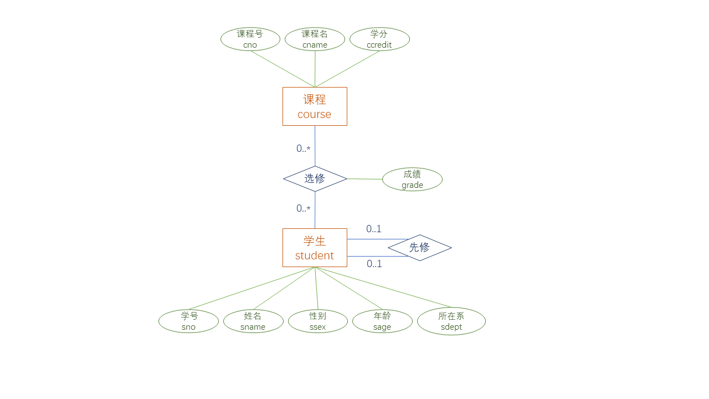
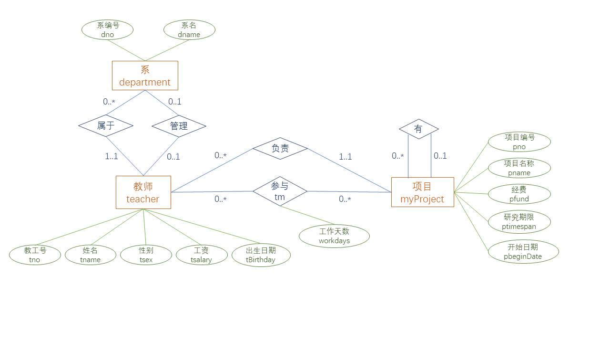

### 实验一题目：



```
--1.创建学生选课关系数据库中的STUDENT表（特别提示：表结构见1.3节，使用书上的表结构是错误的，后同）；
--2.创建学生选课关系数据库中的COURSE表；
--3.创建学生选课关系数据库中的SC表；
--4.运行下列语句，为基本表添加数据；
--以下为学生表的初始数据
insert into Student(sname,ssex,sno, sage, sdept) values('李勇','男','200215121',20,'CS');
insert into Student(sname,ssex,sno, sage, sdept) values('刘晨','女','200215122',19,'CS');
insert into Student(sname,ssex,sno, sage, sdept) values('王敏','女','200215123',18,'MA');
insert into Student(sname,ssex,sno, sage, sdept) values('张立','男','200215125',19,'IS');
--以下为课程表的初始数据
insert into course(cno,cname,cpno,ccredit) values('6','数据处理',null,2);
insert into course(cno,cname,cpno,ccredit) values('2','数学',null,2);
insert into course(cno,cname,cpno,ccredit) values('7','PASCAL语言','6',4);
insert into course(cno,cname,cpno,ccredit) values('5','数据结构','7',4);
insert into course(cno,cname,cpno,ccredit) values('1','数据库','5',4);
insert into course(cno,cname,cpno,ccredit) values('3','信息系统','1',4);
insert into course(cno,cname,cpno,ccredit) values('4','操作系统','6',3);
--以下为选修表的初始数据
insert into sc(sno,cno,grade) values('200215121','1',92);
insert into sc(sno,cno,grade) values('200215121','2',85);
insert into sc(sno,cno,grade) values('200215121','3',88);
insert into sc(sno,cno,grade) values('200215122','2',90);
insert into sc(sno,cno,grade) values('200215122','3',80);
commit;
--5.修改Student表结构，为Student表格添加一个“入学时间”属性，属性名为Senrollment，各元组在属性Senrollment的值是多少；
--6.修改Student表结构，把Ssex列的宽度设置为6个字节；
--7.修改Student表结构，删除Senrollment列；
--8.创建视图ds，该视图包含所有选修了“数据库原理”的学生信息（如果提示没有权限，请使用管理员授予当前用户Create view权限）；
--9.创建视图maleStudent，该视图包含男学生所有信息，通过视图maleStudent更新基本表数据时必须保证学生性别为男；
--10.删除视图maleStudent；
--11.为Course表的CName列建立唯一索引，索引名称为uniqueCname；
--12.试着为Course表的Cpno列建立唯一索引，索引名为indexCpno1，如果发生错误，请说明普通索引和唯一索引有何区别；
--13.为Cource表的Cpno列建立普通索引，索引名称为indexCpno2；
--14.删除索引indexCpno2；
--15.删除基本表Student，如果发生错误，请分析原因；
--16.删除基本表SC；
--17.参考1.3节学生选课关系数据库的表结构，列出各个关系表应有的主码和外码约束（文字回答即可）；
--18.查看已创建的Student、SC、Course表的约束，如果某个表缺少应有的主码或外码约束，为该表添加缺失的主码或外码约束。
```

### 实验一解答：

```
--1.创建学生选课关系数据库中的STUDENT表（特别提示：表结构见1.3节，使用书上的表结构是错误的，后同）；
create table student
(sno varchar(9) primary key,
sname varchar(20) unique,
ssex varchar(4),
sage smallint,
sdept varchar(20)
);
--2.创建学生选课关系数据库中的COURSE表；
create table course
(cno varchar(4)primary key,
cname varchar(40),
cpno varchar(4),
ccredit smallint,
foreign key (cpno) references course(cno)
);
--3.创建学生选课关系数据库中的SC表；
create table sc
(sno varchar(9),
cno varchar(4),
grade smallint,
primary key(sno,cno),
foreign key (sno) references student(sno),
foreign key (cno) references course(cno)
);
--4.运行下列语句，为基本表添加数据；
--以下为学生表的初始数据
insert into Student(sname,ssex,sno, sage, sdept) values('李勇','男','200215121',20,'CS');
insert into Student(sname,ssex,sno, sage, sdept) values('刘晨','女','200215122',19,'CS');
insert into Student(sname,ssex,sno, sage, sdept) values('王敏','女','200215123',18,'MA');
insert into Student(sname,ssex,sno, sage, sdept) values('张立','男','200215125',19,'IS');
--以下为课程表的初始数据
insert into course(cno,cname,cpno,ccredit) values('6','数据处理',null,2);
insert into course(cno,cname,cpno,ccredit) values('2','数学',null,2);
insert into course(cno,cname,cpno,ccredit) values('7','PASCAL语言','6',4);
insert into course(cno,cname,cpno,ccredit) values('5','数据结构','7',4);
insert into course(cno,cname,cpno,ccredit) values('1','数据库','5',4);
insert into course(cno,cname,cpno,ccredit) values('3','信息系统','1',4);
insert into course(cno,cname,cpno,ccredit) values('4','操作系统','6',3);
--以下为选修表的初始数据
insert into sc(sno,cno,grade) values('200215121','1',92);
insert into sc(sno,cno,grade) values('200215121','2',85);
insert into sc(sno,cno,grade) values('200215121','3',88);
insert into sc(sno,cno,grade) values('200215122','2',90);
insert into sc(sno,cno,grade) values('200215122','3',80);
commit;
--5.修改Student表结构，为Student表格添加一个“入学时间”属性，属性名为Senrollment，各元组在属性Senrollment的值是多少；
alter table student add senrollment date;
--6.修改Student表结构，把Ssex列的宽度设置为6个字节；
alter table student modify ssex varchar(6);
--7.修改Student表结构，删除Senrollment列；
alter table student drop column senrollment;
--8.创建视图ds，该视图包含所有选修了“数据库”的学生信息（如果提示没有权限，请使用管理员授予当前用户Create view权限）；
create view ds as (select * from student where sno in (select sno from sc where cno in 
    (select cno from course where cname = '数据库')));
--9.创建视图maleStudent，该视图包含男学生所有信息，通过视图maleStudent更新基本表数据时必须保证学生性别为男；
create view malestudent as (select * from student where ssex = '男')with check option;
--10.删除视图maleStudent；
drop view malestudent;
--11.为Course表的CName列建立唯一索引，索引名称为uniqueCname；
create unique index uniquecname on course(cname);
--12.试着为Course表的Cpno列建立唯一索引，索引名为indexCpno1，如果发生错误，请说明普通索引和唯一索引有何区别；
create unique index indexcpno1 on course(cpno);
--失败，因为cpno原来就已经有一个唯一索引了
--13.为Cource表的Cpno列建立普通索引，索引名称为indexCpno2；
create index indexcpno2 on course(cpno);
--成功！唯一索引只能有一个，普通索引可以有很多个。
--即使这个属性已经有唯一索引了，这个输入仍可以有普通索引
--14.删除索引indexCpno2；
drop index indexcpno2;
--15.删除基本表Student，如果发生错误，请分析原因；
drop table student;
--删除失败，因为sc表外键关联了student
--要删除必须使用级联删除：drop table student cascade constaints;
--16.删除基本表SC；
drop table sc;
--17.参考1.3节学生选课关系数据库的表结构，列出各个关系表应有的主码和外码约束（文字回答即可）；
--18.查看已创建的Student、SC、Course表的约束，如果某个表缺少应有的主码或外码约束，为该表添加缺失的主码或外码约束。
```

### 实验二题目



初始化

```
项目信息管理数据库DDL(Oracle SQL)
alter table Department
   drop constraint FK_DEPARTME_MANAGE_TEACHER;
alter table MyProject
   drop constraint FK_MYPROJEC_PP_MYPROJEC;
alter table MyProject
   drop constraint FK_MYPROJEC_PROJECTMA_TEACHER;
alter table TM
   drop constraint FK_TM_TM_TEACHER;
alter table TM
   drop constraint FK_TM_TM2_MYPROJEC;
alter table Teacher
   drop constraint FK_TEACHER_BELONGTO_DEPARTME;
drop table Department cascade constraints;
drop table MyProject cascade constraints;
drop table TM cascade constraints;
drop table Teacher cascade constraints;
/*==============================================================*/
/* Table: Department                                            */
/*==============================================================*/
create table Department 
(
   DNO                  VARCHAR2(10)         not null,
   TNO                  VARCHAR2(20),
   DName                NVARCHAR2(20)        not null,
   constraint PK_DEPARTMENT primary key (DNO)
);
/*==============================================================*/
/* Table: MyProject                                             */
/*==============================================================*/
create table MyProject 
(
   PNO                  VARCHAR2(20)         not null,
   ParentPno            VARCHAR2(20),
   TNO                  VARCHAR2(20)         not null,
   PName                NVARCHAR2(30)        not null,
   PFund                NUMBER(20,2),
   PBeginDate           DATE                 not null,
   PTimeSpan            INTEGER              not null,
   constraint PK_MYPROJECT primary key (PNO)
);
/*==============================================================*/
/* Table: TM                                                    */
/*==============================================================*/
create table TM 
(
   TNO                  VARCHAR2(20)         not null,
   PNO                  VARCHAR2(20)         not null,
   WorkDays             INTEGER,
   constraint PK_TM primary key (TNO, PNO)
);
/*==============================================================*/
/* Table: Teacher                                               */
/*==============================================================*/
create table Teacher 
(
   TNO                  VARCHAR2(20)         not null,
   DNO                  VARCHAR2(10)         not null,
   TName                NVARCHAR2(20)        not null,
   TSex                 VARCHAR2(3)          not null,
   TSalary              NUMBER(30,2),
   TBirthday            DATE                 not null,
   constraint PK_TEACHER primary key (TNO)
);
alter table Department
   add constraint FK_DEPARTME_MANAGE_TEACHER foreign key (TNO)
      references Teacher (TNO);
alter table MyProject
   add constraint FK_MYPROJEC_PP_MYPROJEC foreign key (ParentPno)
      references MyProject (PNO);
alter table MyProject
   add constraint FK_MYPROJEC_PROJECTMA_TEACHER foreign key (TNO)
      references Teacher (TNO);
alter table TM
   add constraint FK_TM_TM_TEACHER foreign key (TNO)
      references Teacher (TNO);
alter table TM
   add constraint FK_TM_TM2_MYPROJEC foreign key (PNO)
      references MyProject (PNO);
alter table Teacher
   add constraint FK_TEACHER_BELONGTO_DEPARTME foreign key (DNO)
      references Department (DNO);
--3.2	项目信息管理数据库初始化数据
--系表数据
insert into department(dno,dname) values('d001', '计算机科学系');
insert into department(dno,dname) values('d002', '网络工程系');
insert into department(dno,dname) values('d003', '软件工程系');
--教师表数据
insert into teacher(tno, tname, tsex, tsalary, tbirthday, dno) values('t001', '张三', '男', 3000, To_date('7-7月-1977', 'DD-mon-yyyy'), 'd001');
insert into teacher(tno, tname, tsex,  tsalary, tbirthday, dno) values('t002', '李四', '女', 3600, To_date('21-10月-1979', 'DD-mon-yyyy'), 'd001');
insert into teacher(tno, tname, tsex,  tsalary, tbirthday, dno) values('t003', '王五', '女', 5600, To_date('7-7月-1981', 'DD-mon-yyyy'), 'd002');
insert into teacher(tno, tname, tsex,  tsalary, tbirthday, dno) values('t004', '刘晨', '女', 5800, To_date('7-7月-1985', 'DD-mon-yyyy'), 'd002');
insert into teacher(tno, tname, tsex,  tsalary, tbirthday, dno) values('t005', '王二小', '男', 3500, To_date('7-7月-1981', 'DD-mon-yyyy'), 'd003');
insert into teacher(tno, tname, tsex,  tsalary, tbirthday, dno) values('t006', '李小龙', '男', 5687, To_date('7-12月-1990', 'DD-mon-yyyy'), 'd003');
insert into teacher(tno, tname, tsex,  tsalary, tbirthday, dno) values('t007', '熊猫', '男', 6000, To_date('27-11月-1980', 'DD-mon-yyyy'), 'd003');
insert into teacher(tno, tname, tsex,  tsalary, tbirthday, dno) values('t008', '李小小', '女', 5687, To_date('17-10月-1985', 'DD-mon-yyyy'), 'd001');
--myproject数据
insert into myproject(PNO, pname, pfund, pbegindate, ptimespan, parentpno, tno)
values('p0001', '信息安全技术研究', 30, To_date('7-12月-2012', 'DD-mon-yyyy'), 3, null, 't001');
insert into myproject(PNO, pname, pfund, pbegindate, ptimespan, parentpno, tno)
values('p0002', '云计算研究', 40, To_date('7-12月-2008', 'DD-mon-yyyy'), 4, null, 't003');
insert into myproject(PNO, pname, pfund, pbegindate, ptimespan, parentpno, tno)
values('p0003', '信息中心网络研究', 60, To_date('7-12月-2012', 'DD-mon-yyyy'), 6, null, 't006');
insert into myproject(PNO, pname, pfund, pbegindate, ptimespan, parentpno, tno)
values('p0004', '对等网络研究', 30, To_date('7-12月-2010', 'DD-mon-yyyy'), 3, 'p0002', 't006');
--tm数据
insert into tm(tno, pno, workdays) values('t001', 'p0001', 180);
insert into tm(tno, pno, workdays) values('t001', 'p0002', 180);
insert into tm(tno, pno, workdays) values('t001', 'p0004', 360);
insert into tm(tno, pno, workdays) values('t001', 'p0003', 540);
insert into tm(tno, pno, workdays) values('t002', 'p0001', 720);
insert into tm(tno, pno, workdays) values('t002', 'p0002', 90);
insert into tm(tno, pno, workdays) values('t002', 'p0004', 90);
insert into tm(tno, pno, workdays) values('t003', 'p0001', 180);
insert into tm(tno, pno, workdays) values('t003', 'p0002', 360);
insert into tm(tno, pno, workdays) values('t003', 'p0003', 360);
insert into tm(tno, pno, workdays) values('t003', 'p0004', 360);
insert into tm(tno, pno, workdays) values('t004', 'p0001', 180);
insert into tm(tno, pno, workdays) values('t004', 'p0002', 180);
insert into tm(tno, pno, workdays) values('t004', 'p0003', 360);
insert into tm(tno, pno, workdays) values('t005', 'p0004', 180);
insert into tm(tno, pno, workdays) values('t005', 'p0002', 720);
insert into tm(tno, pno, workdays) values('t005', 'p0003', 180);
insert into tm(tno, pno, workdays) values('t006', 'p0004', 360);
insert into tm(tno, pno, workdays) values('t006', 'p0002', 180);
insert into tm(tno, pno, workdays) values('t006', 'p0003', 720);
update department set tno='t006' where dno='d003';
commit;
```

```
--1.查询系号为“d001”的所有教师的教工号、名称和工资；
--2.查询工资在3000到5000之间的教师姓名、年龄（提示：可使用当前年份减去教师的出生年份，教师的出生年份可以使用函数extract(year from tbirthday)获取）；
--3.查询参加了项目的教工的编号，排除相同的元素；
--4.查询名字中包含字“小”的教工姓名、出生日期；
--5.查询名字中第二个字为“小”的教工姓名、出生日期；
--6.查询所有不姓“李”、并且姓名为三个字的教工姓名、性别；
--7.查询Department表有系主任的系号、系名称；
--8.查询工资在4000以上或者性别为女的教师详细信息，按性别降序排列输出；
--9.查询参与了项目的教工总人数；
--10.查询“张三”负责的项目数量； 
--11.查询所有教师的平均工资、工资总和、最高工资、最低工资；
--12.创建视图departmentSalary，查询各个系的教师的平均工资、工资总和、最高工资、最低工资；
--13.查询各个系的详细信息，包括各个系的教师的平均工资、工资总和、最高工资、最低工资(提示：可以使用department表与视图departmentSalary进行连接运算完成)；
--14.查询教师平均工资大于4500的系号、系名称、平均工资（提示：要求不能使用视图departmentSalary，可把department与teacher连接后再进行分组，然后使用having子句对分组进行筛选）；
--15.查询教师参与项目的情况，列出教工号、姓名和项目名称，没有参与项目的教师也列出来（提示：用左外连接）；
--16.查询与“李小龙”工资相同的教师详细信息（要求分别使用自身连接、子查询两种查询方法完成）；
--17.查询参与了“云计算研究”并且工资在4000以上的教师详细信息；
--18.查询小于或等于“同一系中教师平均工资”的教工号、姓名、年龄（提示：请参阅书本的“相关子查询”示例）；
--19.查询比“计算机科学系”教师工资都高、并且不是“网络工程系”的教师信息；
--20.查询没有参与项目“p0001”的教工号、姓名；
--21.查询参与了所有项目的教师姓名；
--22.查询工资大于3500或者在计算机科学系工作的教师详细信息（要求使用关键字UNION）；
--23.查询工资大于3500并且不在计算机科学系工作的教师详细信息（要求使用关键字MINUS）；
```

### 实验二解答

```
--项目信息管理数据库DDL(Oracle SQL)
alter table Department
   drop constraint FK_DEPARTME_MANAGE_TEACHER;
alter table MyProject
   drop constraint FK_MYPROJEC_PP_MYPROJEC;
alter table MyProject
   drop constraint FK_MYPROJEC_PROJECTMA_TEACHER;
alter table TM
   drop constraint FK_TM_TM_TEACHER;
alter table TM
   drop constraint FK_TM_TM2_MYPROJEC;
alter table Teacher
   drop constraint FK_TEACHER_BELONGTO_DEPARTME;
drop table Department cascade constraints;
drop table MyProject cascade constraints;
drop table TM cascade constraints;
drop table Teacher cascade constraints;
/*==============================================================*/
/* Table: Department                                            */
/*==============================================================*/
create table Department 
(
   DNO                  VARCHAR2(10)         not null,
   TNO                  VARCHAR2(20),
   DName                NVARCHAR2(20)        not null,
   constraint PK_DEPARTMENT primary key (DNO)
);
/*==============================================================*/
/* Table: MyProject                                             */
/*==============================================================*/
create table MyProject 
(
   PNO                  VARCHAR2(20)         not null,
   ParentPno            VARCHAR2(20),
   TNO                  VARCHAR2(20)         not null,
   PName                NVARCHAR2(30)        not null,
   PFund                NUMBER(20,2),
   PBeginDate           DATE                 not null,
   PTimeSpan            INTEGER              not null,
   constraint PK_MYPROJECT primary key (PNO)
);
/*==============================================================*/
/* Table: TM                                                    */
/*==============================================================*/
create table TM 
(
   TNO                  VARCHAR2(20)         not null,
   PNO                  VARCHAR2(20)         not null,
   WorkDays             INTEGER,
   constraint PK_TM primary key (TNO, PNO)
);
/*==============================================================*/
/* Table: Teacher                                               */
/*==============================================================*/
create table Teacher 
(
   TNO                  VARCHAR2(20)         not null,
   DNO                  VARCHAR2(10)         not null,
   TName                NVARCHAR2(20)        not null,
   TSex                 VARCHAR2(3)          not null,
   TSalary              NUMBER(30,2),
   TBirthday            DATE                 not null,
   constraint PK_TEACHER primary key (TNO)
);
alter table Department
   add constraint FK_DEPARTME_MANAGE_TEACHER foreign key (TNO)
      references Teacher (TNO);
alter table MyProject
   add constraint FK_MYPROJEC_PP_MYPROJEC foreign key (ParentPno)
      references MyProject (PNO);
alter table MyProject
   add constraint FK_MYPROJEC_PROJECTMA_TEACHER foreign key (TNO)
      references Teacher (TNO);
alter table TM
   add constraint FK_TM_TM_TEACHER foreign key (TNO)
      references Teacher (TNO);
alter table TM
   add constraint FK_TM_TM2_MYPROJEC foreign key (PNO)
      references MyProject (PNO);
alter table Teacher
   add constraint FK_TEACHER_BELONGTO_DEPARTME foreign key (DNO)
      references Department (DNO);
--3.2	项目信息管理数据库初始化数据
--系表数据
insert into department(dno,dname) values('d001', '计算机科学系');
insert into department(dno,dname) values('d002', '网络工程系');
insert into department(dno,dname) values('d003', '软件工程系');
--教师表数据
insert into teacher(tno, tname, tsex, tsalary, tbirthday, dno) values('t001', '张三', '男', 3000, To_date('7-7月-1977', 'DD-mon-yyyy'), 'd001');
insert into teacher(tno, tname, tsex,  tsalary, tbirthday, dno) values('t002', '李四', '女', 3600, To_date('21-10月-1979', 'DD-mon-yyyy'), 'd001');
insert into teacher(tno, tname, tsex,  tsalary, tbirthday, dno) values('t003', '王五', '女', 5600, To_date('7-7月-1981', 'DD-mon-yyyy'), 'd002');
insert into teacher(tno, tname, tsex,  tsalary, tbirthday, dno) values('t004', '刘晨', '女', 5800, To_date('7-7月-1985', 'DD-mon-yyyy'), 'd002');
insert into teacher(tno, tname, tsex,  tsalary, tbirthday, dno) values('t005', '王二小', '男', 3500, To_date('7-7月-1981', 'DD-mon-yyyy'), 'd003');
insert into teacher(tno, tname, tsex,  tsalary, tbirthday, dno) values('t006', '李小龙', '男', 5687, To_date('7-12月-1990', 'DD-mon-yyyy'), 'd003');
insert into teacher(tno, tname, tsex,  tsalary, tbirthday, dno) values('t007', '熊猫', '男', 6000, To_date('27-11月-1980', 'DD-mon-yyyy'), 'd003');
insert into teacher(tno, tname, tsex,  tsalary, tbirthday, dno) values('t008', '李小小', '女', 5687, To_date('17-10月-1985', 'DD-mon-yyyy'), 'd001');
--myproject数据
insert into myproject(PNO, pname, pfund, pbegindate, ptimespan, parentpno, tno)
values('p0001', '信息安全技术研究', 30, To_date('7-12月-2012', 'DD-mon-yyyy'), 3, null, 't001');
insert into myproject(PNO, pname, pfund, pbegindate, ptimespan, parentpno, tno)
values('p0002', '云计算研究', 40, To_date('7-12月-2008', 'DD-mon-yyyy'), 4, null, 't003');
insert into myproject(PNO, pname, pfund, pbegindate, ptimespan, parentpno, tno)
values('p0003', '信息中心网络研究', 60, To_date('7-12月-2012', 'DD-mon-yyyy'), 6, null, 't006');
insert into myproject(PNO, pname, pfund, pbegindate, ptimespan, parentpno, tno)
values('p0004', '对等网络研究', 30, To_date('7-12月-2010', 'DD-mon-yyyy'), 3, 'p0002', 't006');
--tm数据
insert into tm(tno, pno, workdays) values('t001', 'p0001', 180);
insert into tm(tno, pno, workdays) values('t001', 'p0002', 180);
insert into tm(tno, pno, workdays) values('t001', 'p0004', 360);
insert into tm(tno, pno, workdays) values('t001', 'p0003', 540);
insert into tm(tno, pno, workdays) values('t002', 'p0001', 720);
insert into tm(tno, pno, workdays) values('t002', 'p0002', 90);
insert into tm(tno, pno, workdays) values('t002', 'p0004', 90);
insert into tm(tno, pno, workdays) values('t003', 'p0001', 180);
insert into tm(tno, pno, workdays) values('t003', 'p0002', 360);
insert into tm(tno, pno, workdays) values('t003', 'p0003', 360);
insert into tm(tno, pno, workdays) values('t003', 'p0004', 360);
insert into tm(tno, pno, workdays) values('t004', 'p0001', 180);
insert into tm(tno, pno, workdays) values('t004', 'p0002', 180);
insert into tm(tno, pno, workdays) values('t004', 'p0003', 360);
insert into tm(tno, pno, workdays) values('t005', 'p0004', 180);
insert into tm(tno, pno, workdays) values('t005', 'p0002', 720);
insert into tm(tno, pno, workdays) values('t005', 'p0003', 180);
insert into tm(tno, pno, workdays) values('t006', 'p0004', 360);
insert into tm(tno, pno, workdays) values('t006', 'p0002', 180);
insert into tm(tno, pno, workdays) values('t006', 'p0003', 720);
update department set tno='t006' where dno='d003';
commit;

--1.查询系号为“d001”的所有教师的教工号、名称和工资；
select tno,tname,tsalary from teacher where dno = 'd001';
--2.查询工资在3000到5000之间的教师姓名、年龄（提示：可使用当前年份减去教师的出生年份，教师的出生年份可以使用函数extract(year from tbirthday)获取）；
select tname,2019-extract(year from tbirthday) 年龄 from teacher where tsalary between 3000 and 5000;
--3.查询参加了项目的教工的编号，排除相同的元素；
select distinct tno from tm;
--4.查询名字中包含字“小”的教工姓名、出生日期；
select tname,tbirthday from teacher where tname like '%小%';
--5.查询名字中第二个字为“小”的教工姓名、出生日期；
select tname,tbirthday from teacher where tname like '_小%';
--6.查询所有不姓“李”、并且姓名为三个字的教工姓名、性别；
select tname,tsex from teacher where tname not like '李%' and tname like '___';
--7.查询Department表有系主任的系号、系名称；
select dno,dname from department where tno is not null;
--8.查询工资在4000以上或者性别为女的教师详细信息，按性别降序排列输出；
select * from teacher where tsalary > 4000 or tsex like '女' order by tsex desc;
--9.查询参与了项目的教工总人数；
select count(distinct tno) from tm;
--10.查询“张三”负责的项目数量； 
select count(*) from tm where tno in (select tno from teacher where tname = '张三');
--11.查询所有教师的平均工资、工资总和、最高工资、最低工资；
select avg(tsalary)平均工资,sum(tsalary)工资总和,max(tsalary)最高工资,min(tsalary)最低工资 
    from teacher;
--12.创建视图departmentSalary，查询各个系的教师的平均工资、工资总和、最高工资、最低工资；
create view departmentsalary as (
    select dno,avg(tsalary)平均工资,sum(tsalary)工资总和,max(tsalary)最高工资,min(tsalary)最低工资
    from teacher group by dno);
--13.查询各个系的详细信息，包括各个系的教师的平均工资、工资总和、最高工资、最低工资(提示：可以使用department表与视图departmentSalary进行连接运算完成)；
select * from department,departmentsalary where department.dno = departmentsalary.dno;
--14.查询教师平均工资大于4500的系号、系名称、平均工资（提示：要求不能使用视图departmentSalary，可把department与teacher连接后再进行分组，然后使用having子句对分组进行筛选）；
select department.dno,dname,avg(tsalary) 平均工资 
from department,teacher 
where department.dno = teacher.dno 
group by department.dno,dname 
having avg(tsalary)>4500;
--这里要很注意：group by 后面跟着的department.dno,dname要是同一个类的
--15.查询教师参与项目的情况，列出教工号、姓名和项目名称，没有参与项目的教师也列出来（提示：用左外连接）；
select teacher.tno,teacher.tname,pname from teacher left outer join 
    (select tm.tno,pname from tm,myproject where tm.pno = myproject.pno)p on(teacher.tno=p.tno);
--16.查询与“李小龙”工资相同的教师详细信息（要求分别使用自身连接、子查询两种查询方法完成）；
select t1.* from teacher t1,teacher t2 where t1.tno!=t2.tno and t2.tname = '李小龙' and t1.tsalary = t2.tsalary;
select * from teacher t1 where tsalary = (select tsalary from teacher t2 where tname = '李小龙' and t1.tno != t2.tno);
--17.查询参与了“云计算研究”并且工资在4000以上的教师详细信息；
select t1.* from teacher t1,tm,myproject 
where t1.tno = tm.tno and tm.pno = myproject.pno and tsalary > 4000 and pname = '云计算研究';
--18.查询小于或等于“同一系中教师平均工资”的教工号、姓名、年龄（提示：请参阅书本的“相关子查询”示例）；
select tno,tname,2019-extract(year from tbirthday) from teacher t1 where tsalary <= (select avg(tsalary) from teacher t2 where t1.dno = t2.dno);
--19.查询比“计算机科学系”教师工资都高、并且不是“网络工程系”的教师信息；
select * from teacher where teacher.dno != (select dno from department where dname = '网络工程系') and 
    tsalary > (select max(tsalary) from teacher where dno = (select dno from department where dname = '计算机科学系'));
--20.查询没有参与项目“p0001”的教工号、姓名；
select tno,tname from teacher where tno not in(select tno from tm where pno = 'p0001');
--21.查询参与了所有项目的教师姓名；
select tname from teacher where not exists  
(select * from myproject where not exists
(select * from tm where tno=teacher.tno and pno = myproject.pno));
--这个老师没有一个项目不参加
--22.查询工资大于3500或者在计算机科学系工作的教师详细信息（要求使用关键字UNION）；
select * from teacher where tsalary > 3500
union
select * from teacher where dno in (select dno from department where dname = '计算机科学系');
--23.查询工资大于3500并且不在计算机科学系工作的教师详细信息（要求使用关键字MINUS）；
select * from teacher where tsalary > 3500
minus
select * from teacher where dno in (select dno from department where dname = '计算机科学系');
```

### 实验三题目

```
1.列出Teacher表的所有约束，并说明每个约束的具体含义及其对表列取值的影响；
--2.书写SQL语句，在Teacher表中插入2条元组，元组内容任意设置，要求能取空值的列均设置为空（提示：如果插入失败，则查看是否满足基本表的约束条件）；
--3.利用“create table teacher2 as select * from teacher”语句创建表teacher2，并列出Teacher2表的所有约束，比较Teacher2表与Teacher表的约束差异；
--4.任取teacher表中的一条元组，把这条元组分别插入到teacher2和Teacher表中，比较两次插入操作的运行结果并分析原因（要求插入失败时必须指出违反了哪类完整性约束条件）；
--5.使用带子查询的插入语句把teacher表中的所有男教师插入到teacher2表中；
--6.为表Teacher添加check约束，使性别的取值只能为“男”或者“女”；
--7.删除teacher2表中工资等于6000的教师信息；
--8.删除teacher2表中“计算机科学系”的所有教师；
--9.删除teacher2表中的所有教师；
--10.修改teacher2表，使列tno为主码，主码约束名字为PK_teacher2；
--11.为teacher2表添加唯一约束，使tname的取值不能重复；
--12.修改teacher2表，使列dno成为外码，引用department表的主码dno，当删除department表中的元组时，级联删除Teacher2表中的元组（提示：删除并重新创建外码约束，使用ON DELETE CASCADE选项）；
--13.在department表中插入一个新系，系号为“xyz”，在Teacher2表中为该新系添加两个教师信息；
--14.分别写出删除department表中系号为d001和xyz的记录的SQL语句并执行，比较并分析执行结果（提示：在Teacher表和Teacher2表中的外码定义是不同的）；
--15.在tm中插入一条元组，只设置tno、pno的值；
--16.给teacher表中的所有教师的工资增加100；
--17.给teacher表中的“计算机科学系”教师的工资增加100；
--18.创建两个视图VT、VT2，两个视图均为包含所有teacher表的男教师的信息，但视图VT2的定义带有with check option选项，设置一条女教师信息记录，指出通过哪个视图可以成功插入记录，并说明with check option选项的作用；

```

### 实验三解答

一些解答
```
--3.利用“create table teacher2 as select * from teacher”语句创建表teacher2，并列出Teacher2表的所有约束，比较Teacher2表与Teacher表的约束差异；
create table teacher2 as select * from teacher;
--6.为表Teacher添加check约束，使性别的取值只能为“男”或者“女”；
alter table teacher add check(tsex = '男' or tsex = '女');
--7.删除teacher2表中工资等于6000的教师信息；
delete from teacher2 where tsalary =6000;
--9.删除teacher2表中的所有教师；
delete from teacher2;
--10.修改teacher2表，使列tno为主码，主码约束名字为PK_teacher2；
alter table teacher2 add constraints pk_teacher2 primary key(tno);
--11.为teacher2表添加唯一约束，使tname的取值不能重复；
alter table teacher2 add unique(tname);
--12.修改teacher2表，使列dno成为外码，引用department表的主码dno，当删除department表中的元组时，级联删除Teacher2表中的元组（提示：删除并重新创建外码约束，使用ON DELETE CASCADE选项）；
alter table teacher2 add foreign key(dno) references department(dno)on delete cascade;
```