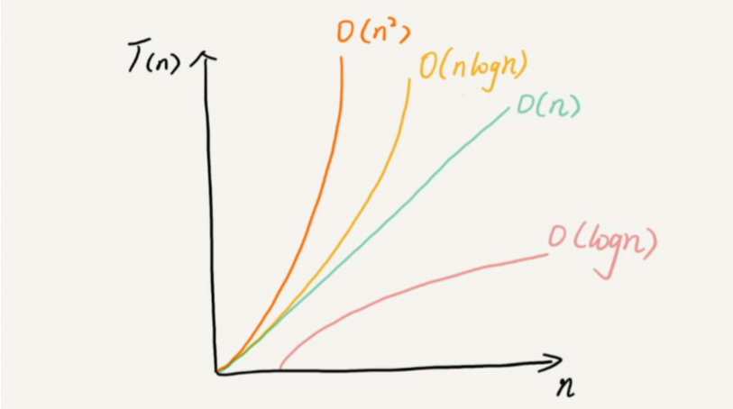
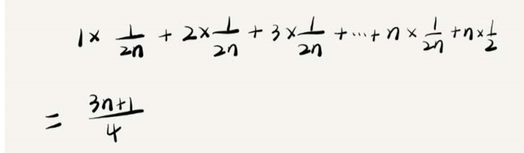

## 初识数据结构和算法

### 什么是数据结构？什么是算法？
广义上来讲，数据结构就是一组数据的存储结构。算法就是操作数据的一组方法。

狭义上来讲：我们通常指的是著名的数据结构和算法，比如队列、栈、堆、二分查找、动态规划等，这些都是前人智慧的结晶，我们可以拿来就用。

数据结构和算法有什么关系呢？为什么大部分书要把这两个东西放在一起讲呢？  
这是因为，数据结构和算法是相辅相成的。数据结构是为算法服务的，算法要在特定的数据结构之上。因此我们无法孤立数据结构和算法的关系。  
比如，因为数组具有随机访问的特点，常用的二分查找就需要用数组这种数据结构来存储数据；但如果我们选择链表这种数据结构，二分查找就达不到效果，因为链表不支持随机访问。

### 如何学好这门课?
有一些技巧可以让你的学习事半功倍：
1. 边学边练，适当刷题
2. 多问、多思考、多互动，并可以将知识写成博客
3. 知识需要沉淀，不要想试图一下子掌握所有

## 03复杂度分析（上）：如何分析、统计算法的执行效率和资源消耗？

### 为什么需要复杂度分析？
对于我们的代码，可以通过统计、监控，就能得到算法的执行时间和占用的内存大小。为什么还要做时间、空间复杂度分析呢？

首先，可以肯定地说，通过“统计、监控”这种评估算法执行效率的方法是正确的。但是，这种统计方法还是有一定的局限性。原因如下：
1. 测试结果非常依赖于测试环境。
测试环境中硬件的不同会对测试结果有很大的影响。
2. 测试结构受数据规模的影响很大。  
举个例子：对同一个排序算法，待排序的有序度不一样，排序的执行时间就会有很大的差别。极端情况下，如果数据已经是有序的，那排序算法不需要做任何操作，执行时间就会非常短。  
除此之外，如果测试数据的规模太小，测试结果就无法真实的访问算法的性能。比如，对于一个小规模的排序，插入排序就可以反倒过来会比快速排序还要快！  

### 时间复杂度分析
有三个比较实用的方法可以用来分析时间复杂度：
1. 只关注“循环执行次数”最多的一段代码
2. 加法法则：循环并行
3. 乘法法则：循环嵌套

### 几种常见时间复杂度实例分析
代码千差万别，但是常见的复杂度量级并不多，几种几乎涵盖今后接触的所有代码的复杂度量级如下：
（按数量级递增）
1. 常量阶：O(1)
2. 对数阶：O(log n)
3. 线性阶：O（n）
4. 线性对数阶：O(nlogn)即（n * log n）
5. 平方阶：O（n²）、立方阶O（n³）
6. 指数阶：O(2^n)
7. 阶乘：O（n!）

**对数阶O（log n）和线性对数阶O（nlogn）实例：**
```java
while(int i = 1; i <= n; i++){
	i = i * 2；//i值在循环的取值为：1 2 4 8 16····易知跨度很大，很容易就能达到n值
}
```

**O（m+n）和O（m*n）**
我们先来看实例：
```java
int cal(int m, int n){
	int sum_1 = 0;//m个数求和
	for(int i = 1; i < m; i++){
		sum_1 = sum_1 + i;
	}

	int sum_2 = 0;//n个数求和
	for(int j = 1; j < n; j++){
		sum_2 = sum_2 + j;
	}

	//返回sum_1和sum_2的和
	return sum_1 + sum_2;
}
```
从代码中可以看出，m和n是表示两个数据规模，我们事先无法评估m和n的大小，所以在计算时间复杂度的时候，不能够省略掉其中一个。所以上面代码的时间复杂就是O（m + n）;   
O(m * n)同理

最后，我们来看看前面所说的几种时间复杂度在坐标轴上的表示：


### 空间复杂度实例分析
首先，我们先抛出结论，常见的空间复杂度为：O（1）、O（n)、O（n²)，像O(logn)、O（nlogn）这样的对数阶则不常见。  
下面我们我们看一个实例：
```java
void print(int n){
	int[] a = new int[n];//创建了O（n）的空间
	for(int i = 0; i < n; i++){ //创建了int i的一个辅助空间
		a[i] = i;
	}
}
```
上面的代码，空间复杂度为：O（n）

### 内容小结
**性能测试和时间复杂度、空间复杂度的关系？**
1. 渐进时间复杂度分析、渐进空间复杂度分析为我们提供了一个很好的理论分析方向，能够让我们对我们程序或算法有一个大致的认识。  
2. 但又同时，渐进时间复杂度、渐进空间复杂度只是一个理论模型，只能提供粗略的估计分析，我们不能直接断定O（logN）就一定优于O(n)，针对于不同的数据集，不同的数据量的大小，在实际应用上面可能真正的性能会不同。针对不同的实际情况，对一定的性能测试是很有必要的，比如在同一批手机上（同样的硬件、系统等等）进行横向基准测试，进而选择特定应用场景下的最有效算法。
3. 如上所述，两者并不会冲突，而是相辅相成。但是一个低阶的时间复杂度程序有极大可能会优于一个高阶的时间复杂度程序，所以在实际编程中，时刻关心理论时间，空间复杂度模型是有助于产出效率高的程序的。同时，因为渐进式时间、空间复杂度分析只是一个粗略的分析模型，因此也不会花费太多时间，重点在于编程时，要有这样子的复杂度分析的思维。

## 复杂度分析（下）：浅析最好、最坏、平均、均摊时间复杂度
```java
//在一个无序的数组（array）中，查找变量x出现的位置。
//如果没有找到，就返回-1
int find(int[] array, int n, int x){
	int pos = -1;
	for(int i = 0; i < n; i++){
		if(array[i] == x){
			pos = i;
			break;
		}
	}
	return pos;
}
```
### 最好情况时间复杂度
概念为：在最理想的情况下，执行这段代码的时间复杂度。

上面代码中，最好情况为即只需要查找一次就找到了对应的元素，即最好的时间复杂度为O（n）

### 最坏时间复度
概念为：在最坏的情况下，执行这段代码需要的时间复杂度

上面代码中，最坏情况为：需要遍历整个数组，才能够找到对应的元素，或者找不到对应的元素，这个时候最坏时间复杂度为O（n）

### 平均时间复杂度
我们知道，最好情况时间复杂度和最坏情况时间复杂度都是对应极端情况下的代码复杂度，发生的概率并不大。为了更好的表示平均情况下的复杂度，我们需要引入另一个概念：平均时间复杂度。

平均时间复杂度怎么表示呢，我们还是用上面代码作为例子：
1. 我们知道，要查找的变量x，要么在数组中，要么就不在数组中，假设在数组和不在数组的概率分别为1/2。另外，要查找的数据出现在0~（n-1）这n个位置的概率也是一样的，为1/n。
2. 所以，根据概率论乘法法则，要查找的数据出现在0~n-1的概率分别为1/（2n）
3. 第2个位置出现，需要查找的次数为2/（2n），以此类推，平均时间复杂度为：  

4. 这个值就是概率论中的加权平均值，也叫做期望值，所以平均时间复杂度的全称应该叫做**加权平均时间复杂度**或**期望时间复杂度**

你可能会说，平均时间复杂度分析好复杂，还要涉及概率论的知识。实际上。在大多数情况下，我们并不需要区分最好、最坏、平均情况时间复杂度三种情况。像我们上一节课举得那些例子那样，很多时候，我们使用一个复杂度就可以满足需求了。只有同一块代码在不同的情况下，时间复杂度有**量级**的差距，我们才会使用这3种复杂度表示法来区分。

### 均摊时间复杂度

到此为止，你应该掌握了算法复杂度分析的大部分内容了。下面我们来讲一个更加高级的概念，均摊时间复杂度，以及它对应的分析方法：摊还分析（或者叫做平摊分析）

首先我们还是看一个例子：
```java
//这段代码实现一个往一个数组种插入数据的功能。当数组满了之后，也就是count == array.length时，
//我们用for循环遍历数组求和，并清空数组，将求和之后的sum值放到数组的第一个位置
//array表示一个长度为n的数组
//代码中的array.length就等于n
void test(){
	int[] array = new int[n];
	int count = 0;

	void insert(int val){
		if(count == array.length){
			int sum = 0;
			for(int i = 0; i < array.length; i++){
				sum = sum + array[i];
			}
			array[0] = sum;
			count = 1;
		}//if
		
		array[count] = val;
		++count;
	}
}
```

从上面的例子中，我们可以看到，对于O（1）时间复杂度的插入和O（n）时间复杂度的插入，出现的频率是非常有规律的，而且有一定的前后时序关系，一般都是一个O（n)插入之后，紧跟着n-1个O（1）的插入操作，循环往复。

针对于这种场景，我们引入一个更加简单的分析方法：将一个特殊的O(n)的操作分摊到每一个O（1）上，即：每一个O（1）的操作变成：O（1）+1==>O(1)次，而O（n)因为被分摊，所以也是O（1）

### 内容小结

我们学到了几个关于复杂度分析的概念，分别有：最好情况时间复杂度、最坏情况时间复杂度、平均情况时间复杂度、均摊时间复杂度。

之所以引入这几个复杂度概念，是因为，同一段代码，在不同输入的情况下，复杂度量级有可能是不一样的。

## 05|数组：为什么很多变成语言中数组都是从0开始编号的？

### 如何实现随机访问
数组定义：数组（Array)是一种线性表的数据结构。它用一组连续的内存空间，来存储一组具有相同类型的数据。


