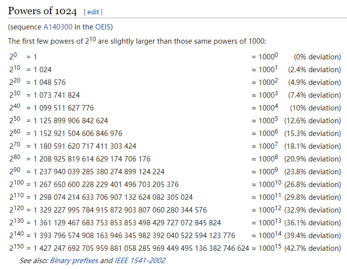

## 目录
- [栈](栈)
- [队列](队列)
- [递归](递归)

## 栈

**定义：**
1. 栈是一种使用受限的线性表，它只能在栈顶进行操作--入栈和出栈；
2. 后进先出是它最大的特点；
3. 栈既可以用数组来实现，也可以用链表来实现；
4. 无论入栈还是出栈，时间复杂度都是O（1）；

**栈为什么而诞生：**


**栈适用的场景：**
计算机的算数运算：3+5*8-6
```
需要定义两个栈：符号栈X和数字栈Y
从左向右扫面字符串，遇到数字栈就将数字压入数字栈Y中；
遇到符号就：将符号同符号栈X的栈顶元素进行比较，如果优先级高则压入栈顶，如果优先级低则“取数字栈Y的两个操作数和符号栈X的一个符号进行运算操作，然后将结果压入数字栈中”
```
编程中的函数调用
```

```
()[]{}括号匹配
```
从左向右扫面字符串，如果遇到（[{就将其压入栈中，如果遇到)]},就将栈顶的元素进行比较，如果配对的弹出栈顶元素；
当所有的字符串扫描完毕后，并且栈中没有元素存在（所有的元素都被弹出去了）就说明括号匹配成功。
```
浏览器的前进后退功能
```
情景：用户在浏览器打开页面，可以实现浏览页面的前进和后退功能；当用户新建了页面，则之前的“可以前进的页面”都会被清零。

需要定义两个栈，假设为X，Y
X栈：存储打开的页面，假设为a,b,c
Y栈：如果用户后退，就将最上面的元素存到Y栈中；如果用户前进，就将Y栈中最上面的元素弹出并存到X栈中；如果用户新建页面，着Y栈中的所有元素清零。

```

**栈的优点：**

**栈的局限性：**

**如何使用栈：**
- **思考角度：**
	栈的用法直接可以使用容器，不用关注信号量的细节

	更加具体的思考方式为：什么时候使用栈。
	栈的思路为：后进先出，因此在处理匹配的问题时，及其适用

- **入栈**
	空间复杂度：需要额外使用几个临时变量，因此空间复杂度为O（1）；需要注意的是，顺序栈需要一个大小为n的数组，但是因为这个大小为n的数组是必须存在的，因此不算入空间复杂度中。
- **出栈**

**额外拓展--支持动态扩容的顺序栈**
	
--》实际应用中并不常见，主要懂得如何分析时间复杂度。
情景：当栈的存储空间不够时，会重新申请一块大小为原来2倍的内存大小，并将所有的数据搬移过去。
时间复杂度分析：假设原来的空间大小为k,当这个空间满了之后，会重新申请2k的空间大小，然后将k的数据搬移过去，再进行入栈操作；因此在接下来的操作中，k-1的入栈操作时间复杂度为O（1）【最好时间复杂度】，1次的入栈操作是O（K）【最坏时间复杂度】；采用均摊时间复杂度分析方法，一次的O（K）入栈操作的时间均摊到每一次的O（1）入栈操作，那个每次的入栈操作的时间复杂度就变成O（1）+1；因此总的时间复杂度还是O（1）；由此可见，像这种情况，如果采用均摊时间复杂度，那么均摊下来的时间复杂度等于最优时间复杂度O（1）。

## 队列

**定义：**
1. 特点是：先进先出，通过设置head、tail两个信号量来控制进队和出队
2. 是一种受限制的线性表，队列的延申还有循环队列、阻塞队列、并发队列；
3. 可以用数组和队列来实现，但是数组的引用更加广泛？
4. 循环队列中入队和出队的时间复杂度都为O（1)

**队列为什么而诞生:**

**队列的使用:**
- **思考角度：**何时进队，何时出队

入队：enqueue()

出队：dequeue()

循环队列
```
利用模运算：提高空间的利用率，解决数据搬移问题；
循环队列中：head指向的空间有数据；tail指向的空间没有数据；
原因为：队列为空的时候head=tail，插入数据时，head指向的空间插入数据，tail后移，仍没有数据

判断队列是否为空：head==tail
判断队列是否满了：(tail+1)%n==head【%就是取模的意思】[这里注意是tail+1而不是head+1]
入队:tail=（tail+1）%n
出队：head=(head+1)%n
```
阻塞队列
```
阻塞队列在队列的基础上增加了阻塞操作。即队列为空的时候，取数据会被阻塞；队列满的时候，插入数据会受到阻塞

可以通过empty，full等信号量来实现

阻塞队列实际上就是“生产者消费者模型”
```


**队列的应用场景:**

线程池
```
当队列满的时候，有两种处理方式：
1. 非阻塞方式：直接拒绝
2. 阻塞方式：等待其他的数据被取出
```
在任何有限的资源中，用于排队请求：数据库连接池
**队列的优点:**

**队列的缺点:**

## 递归

**定义：**
递：一个问题分解成几个子问题，通过递推公式，递送
归：通过终止条件，收回来

**自己在使用递归时需要注意的问题：**
只要遇到递归，我们就把它抽象成一个递归公式，不用一层一层往下思考子问题和子子问题，子子问题与子子子问题之间的关系。屏蔽掉递归问题的细节。

**递归的使用：**

递归满足的三个条件：
1. 一个问题可以分解为几个子问题的解
2. 这个问题与分解之后的子问题，除了数据规模不同，求解思路完全一样
3. 存在递归终止条件

思考角度为：
1. 终止条件
2. 子问题的求解思路，每一个子问题的思路都是一样的；**假设子问题已经解决**

**递归的应用场景：**
1. 电影院询问自己是在第几排
2. 注册返佣金中找到“最终推荐人”
3. 没有洞察未来的能力，但是可以 尝试/暴力 找到答案 

**递归的优点：**
递归是一种简洁高效的编码技巧。

**递归的缺点：**
1. 警惕堆栈溢出：限制递归的最大调用深度来解决的
```C++
if(death>1000)
throw exception
```
2. 重复计算：使用散列表
3. 耗时
4. 空间复杂度高

## 树

**定义：**
非线性表
根节点、叶子结
树的层次、数据深度、树的高度【结合生活实例】
```
	1		0		3	------------	1
	2		1		2	---------	2		3
	3		2		1	------	4				5
	4		3		0	--    6		7		8		9
```

**树的种类：**
二叉树、完全二叉树（两个字，一半有一半没有）、满二叉树
```
完全二叉树：适合用数组存储；
根节点存在下标为1的位置
左子结点为2*n  右子结点为2*n+1【通过左/右子结点算父节点：int n/2】
```
二叉查找树
平衡二叉树
前缀树
红黑树

**树的使用：**
前/中/后序遍历
```
假设子问题都已经解决;
前序遍历
print t;
printTree(t.lchild);
printTree(t.rchild);
```

**树的应用场景：**

**树的优点：**

**树的缺点：**


### 二分查找

二分查找（Binary Search）：也叫折半查找算法

**指数爆炸**



指数爆炸：每多10，就多1000倍（多3位）；1~30，从1变成了10亿

**优点**

1. 二分查找是一个非常高效的查找算法，与“指数爆炸”相反，指数有多爆炸，二分查找就有多高效
2. 有时候O（log n）的时间复杂度会比O（1）的算法还要高效；因为即使是O（1），也可能表示的是一个非常大的常量值，如O（1000）等

**分治法**

1. 分治法是基于**多项分支递归**的一种很重要的算法范式。
2. 字面上解释是“分而治之”，就是把一个复杂的问题分成**两个或更多或相似的子问题**，直到最后的子问题可以简单求解，原问题即子问题的解的合并
3. 应用：快速排序算法、快速傅里叶变换、Karatsuba快速乘法算法和并行算法、矩阵乘法的施特拉森算法等


**What does O(log n) mean exactly?**

The most common attributes of logarithmic running-time function are that:

- the choice of the next element on which to perform some action is one of several possibilities, and
- only one will need to be chosen.  

or

- the elements on which the action is performed are digits of n

**代码实现**

```C++
public int bsearch(int []a,int n,int value){
	int low=0;
	int high=n-1;
	while(low<=high){
		int mid=(low+(high-low)>>1);//左移运算，low+(high-low)/2
		if(a[mid]==value){
			return mid;
		}
		else if(a[mid]<value){
			low=mid+1;
		}
		else	
		{
			high=mid-1;	
		}
	}
}

```

需要注意的三个要点：

1. 循环退出条件为：low<=high;而不是 low<high
2. mid的取值：不要写成(high+low)/2，因为可能会溢出；可以写成low+(high-low)/2；更加极致的优化：low+(high-low)>>1,因为计算机处理移位操作要比除法更快【同理：为了防止溢出，能用除法不用乘法；能用减法不用加法；但是从时间效率上来看，除法的效率会比乘法低很多】
3. low和high的更新：不能写成low=mid;high=mid，因为你这样子写，如果low=3，high=3，则会造成死循环；要写成low=mid+1;high=mid-1;

**局限性**

1. 依赖顺序表结构：数组（为了随机访问）
2. 不适用于动态的数据：依赖已经排好序，且少排序+多查找：因为排序的时间复杂度最低为O(n * log n)
3. 不适用于处理的数据量较少的场景：可以直接顺序遍历
4. 不适用于处理的数据量较大的场景：数组的特点需要有“连续的存储空间”

**拓展**

如果是是面对于动态的数据查找，可以使用二叉树和散列表，但是，这两种算法则需要消耗更多的存储空间


