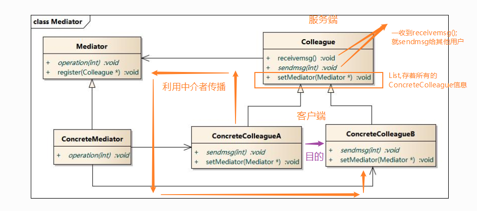

### 中介者模式

**资料来源：**
[刘伟CSDN博客-模式]()  
[图说设计模式-模式]()

**核心简介：**
1. 用一个中介对象（中介者）来封装一系列的对象交互
2. 中介者使各对象不需要显式地相互引用，从而使其耦合松散，而且可以独立地改变它们之间的交互。

**个人理解：**
1. 利用List保存所有的ConcreteColleague，一收到信息，就将信息发给其他人。

**UML图**  



**代码实现：**

客户端测试代码如下：
```java
#include <iostream>
#include "ConcreteColleagueA.h"
#include "ConcreteMediator.h"
#include "ConcreteColleagueB.h"

using namespace std;

int main(int argc, char *argv[])
{
	ConcreteColleagueA * pa = new ConcreteColleagueA();
	ConcreteColleagueB * pb = new ConcreteColleagueB();
	ConcreteMediator * pm = new ConcreteMediator();
	pm->registered(1,pa);
	pm->registered(2,pb);
	
	// sendmsg from a to b
	pa->sendmsg(2,"hello,i am a");
	// sendmsg from b to a
	pb->sendmsg(1,"hello,i am b");
	
	delete pa,pb,pm;
	return 0;
}
```


```java
///////////////////////////////////////////////////////////
//  ConcreteMediator.h
//  Implementation of the Class ConcreteMediator
//  Created on:      07-十月-2014 21:30:47
//  Original author: colin
///////////////////////////////////////////////////////////

#if !defined(EA_8CECE546_61DD_456f_A3E7_D98BC078D8E8__INCLUDED_)
#define EA_8CECE546_61DD_456f_A3E7_D98BC078D8E8__INCLUDED_

#include "ConcreteColleagueB.h"
#include "Mediator.h"
#include "ConcreteColleagueA.h"
#include <map>
using namespace std;
class ConcreteMediator : public Mediator
{

public:
	ConcreteMediator();
	virtual ~ConcreteMediator();

	virtual void operation(int nWho,string str);
	virtual void registered(int nWho, Colleague * aColleague);
private:
	map<int,Colleague*> m_mpColleague;
};
#endif // !defined(EA_8CECE546_61DD_456f_A3E7_D98BC078D8E8__INCLUDED_)
```

```java
///////////////////////////////////////////////////////////
//  ConcreteMediator.cpp
//  Implementation of the Class ConcreteMediator
//  Created on:      07-十月-2014 21:30:48
//  Original author: colin
///////////////////////////////////////////////////////////

#include "ConcreteMediator.h"
#include <map>
#include <iostream>
using namespace std;

ConcreteMediator::ConcreteMediator(){

}

ConcreteMediator::~ConcreteMediator(){

}

void ConcreteMediator::operation(int nWho,string str){
	map<int,Colleague*>::const_iterator itr = m_mpColleague.find(nWho);
	if(itr == m_mpColleague.end())
	{
		cout << "not found this colleague!" << endl;
		return;
	}
	
	Colleague* pc = itr->second;
	pc->receivemsg(str);
}


void ConcreteMediator::registered(int nWho,Colleague * aColleague){
	map<int,Colleague*>::const_iterator itr = m_mpColleague.find(nWho);
	if(itr == m_mpColleague.end())
	{
		m_mpColleague.insert(make_pair(nWho,aColleague));
		//同时将中介类暴露给colleague 
		aColleague->setMediator(this);
	}
}
```

```java
///////////////////////////////////////////////////////////
//  ConcreteColleagueA.h
//  Implementation of the Class ConcreteColleagueA
//  Created on:      07-十月-2014 21:30:47
//  Original author: colin
///////////////////////////////////////////////////////////

#if !defined(EA_79979DD4_1E73_46db_A635_E3F516ACCE0A__INCLUDED_)
#define EA_79979DD4_1E73_46db_A635_E3F516ACCE0A__INCLUDED_

#include "Colleague.h"

class ConcreteColleagueA : public Colleague
{

public:
	ConcreteColleagueA();
	virtual ~ConcreteColleagueA();

	virtual void sendmsg(int toWho,string str);
	virtual void receivemsg(string str);

};
#endif // !defined(EA_79979DD4_1E73_46db_A635_E3F516ACCE0A__INCLUDED_)
```

```java
///////////////////////////////////////////////////////////
//  ConcreteColleagueA.cpp
//  Implementation of the Class ConcreteColleagueA
//  Created on:      07-十月-2014 21:30:47
//  Original author: colin
///////////////////////////////////////////////////////////

#include "ConcreteColleagueA.h"
#include <iostream>
using namespace std;

ConcreteColleagueA::ConcreteColleagueA(){
}

ConcreteColleagueA::~ConcreteColleagueA(){
}

void ConcreteColleagueA::sendmsg(int toWho,string str){
	cout << "send msg from colleagueA,to:" << toWho << endl;
	m_pMediator->operation(toWho,str);
}

void ConcreteColleagueA::receivemsg(string str){
	cout << "ConcreteColleagueA reveivemsg:" << str <<endl;
}
```

编译并运行程序，输出结果如下：
> 

**开发中的应用场景：**
1. MVC模式，，其中的C，控制器就是一个中介者对象
2. 反射的invoke（）方法
----

[回到目录](设计模式目录.md)