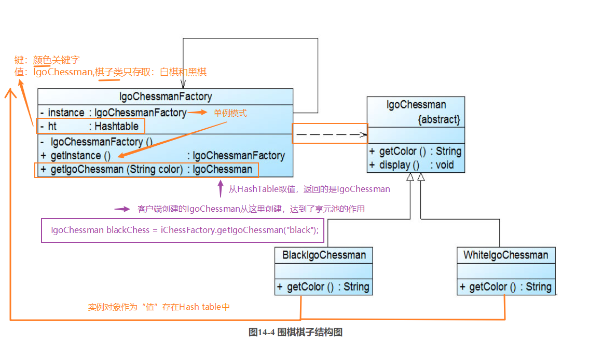

### 享元模式

**资料来源：**
[刘伟CSDN博客-模式](https://blog.csdn.net/lovelion/article/details/7667781)  
[图说设计模式-模式](https://design-patterns.readthedocs.io/zh_CN/latest/structural_patterns/flyweight.html)

**核心简介：**
1. 运用共享技术有效地支持大量细粒度对象的复用。
2. 系统只使用少量的对象，而这些对象都很相似，状态变化很小，可以实现对象的多次复用。
3. 由于享元模式要求能够共享的对象必须是细粒度对象，因此它又称为轻量级模式，它是一种对象结构型模式。

**个人理解：**
1. 享元池的Hashtable是关键，共享的对象通过Hashtable的键值关系创建，这样子就可以达到共享的目的了；
2. 当然，你要知道，你new一个IgoChessman，不同的igoChessman是相互独立的，只是igoCHessman中的共享属性对象是共享的

**UML图**  



**举例应用：**

 Sunny软件公司欲开发一个围棋软件，其界面效果如图14-1所示：
  Sunny软件公司开发人员通过对围棋软件进行分析，发现在围棋棋盘中包含大量的黑子和白子，它们的形状、大小都一模一样，只是出现的位置不同而已。如果将每一个棋子都作为一个独立的对象存储在内存中，将导致该围棋软件在运行时所需内存空间较大，如何降低运行代价、提高系统性能是Sunny公司开发人员需要解决的一个问题。


**代码实现：**

客户端测试代码如下：
```java
class Client {
	public static void main(String args[]) {
		IgoChessman black1,black2,black3,white1,white2;
		IgoChessmanFactory factory;
        
        //获取享元工厂对象
		factory = IgoChessmanFactory.getInstance();
 
        //通过享元工厂获取三颗黑子
		black1 = factory.getIgoChessman("b");
		black2 = factory.getIgoChessman("b");
		black3 = factory.getIgoChessman("b");
		System.out.println("判断两颗黑子是否相同：" + (black1==black2));
 
        //通过享元工厂获取两颗白子
		white1 = factory.getIgoChessman("w");
		white2 = factory.getIgoChessman("w");
		System.out.println("判断两颗白子是否相同：" + (white1==white2));
 
        //显示棋子，同时设置棋子的坐标位置
		black1.display(new Coordinates(1,2));
		black2.display(new Coordinates(3,4));
		black3.display(new Coordinates(1,3));
		white1.display(new Coordinates(2,5));
		white2.display(new Coordinates(2,4));
	}
}
```
IgoChessman充当抽象享元类，BlackIgoChessman和WhiteIgoChessman充当具体享元类，IgoChessmanFactory充当享元工厂类。完整代码如下所示：

```java
import java.util.*;
 
//围棋棋子类：抽象享元类
abstract class IgoChessman {
	public abstract String getColor();
 
	public void display() {
		System.out.println("棋子颜色：" + this.getColor());	
	}
}
 
//黑色棋子类：具体享元类
class BlackIgoChessman extends IgoChessman {
	public String getColor() {
		return "黑色";
	}	
}
 
//白色棋子类：具体享元类
class WhiteIgoChessman extends IgoChessman {
	public String getColor() {
		return "白色";
	}
}
 
//围棋棋子工厂类：享元工厂类，使用单例模式进行设计
class IgoChessmanFactory {
	private static IgoChessmanFactory instance = new IgoChessmanFactory();
	private static Hashtable ht; //使用Hashtable来存储享元对象，充当享元池
	
	private IgoChessmanFactory() {
		ht = new Hashtable();
		IgoChessman black,white;
		black = new BlackIgoChessman();
		ht.put("b",black);
		white = new WhiteIgoChessman();
		ht.put("w",white);
	}
	
    //返回享元工厂类的唯一实例
	public static IgoChessmanFactory getInstance() {
		return instance;
	}
	
    //通过key来获取存储在Hashtable中的享元对象
	public static IgoChessman getIgoChessman(String color) {
		return (IgoChessman)ht.get(color);	
	}
}
```
除了增加一个坐标类Coordinates以外，抽象享元类IgoChessman中的display()方法也将对应增加一个Coordinates类型的参数，用于在显示棋子时指定其坐标，Coordinates类和修改之后的IgoChessman类的代码如下所示：
```java
//坐标类：外部状态类
class Coordinates {
	private int x;
	private int y;
	
	public Coordinates(int x,int y) {
		this.x = x;
		this.y = y;
	}
	
	public int getX() {
		return this.x;
	}
	
	public void setX(int x) {
		this.x = x;
	}
	
	public int getY() {
		return this.y;
	}
	
	public void setY(int y) {
		this.y = y;
	}
} 
 
//围棋棋子类：抽象享元类
abstract class IgoChessman {
	public abstract String getColor();
	
	public void display(Coordinates coord){
		System.out.println("棋子颜色：" + this.getColor() + "，棋子位置：" + coord.getX() + "，" + coord.getY() );	
	}
}
```

编译并运行程序，输出结果如下：
> 判断两颗黑子是否相同：true
> 判断两颗白子是否相同：true
> 棋子颜色：黑色，棋子位置：1，2
> 棋子颜色：黑色，棋子位置：3，4
> 棋子颜色：黑色，棋子位置：1，3
> 棋子颜色：白色，棋子位置：2，5
> 棋子颜色：白色，棋子位置：2，4

**场景：**
1. 内存属于稀缺资源，不要随便浪费，如果有很多个完全相同或相似对象，我们可以通过享元模式，节省内存 
2. 只要出现池，就是容器

**开发中的应用场景：**
1. 享元模式由于共享的特点，可以在任何“池”中操作，比如：线程池、数据库连接池
2. String类的设计也是享元模式

----

[回到目录](设计模式目录.md)