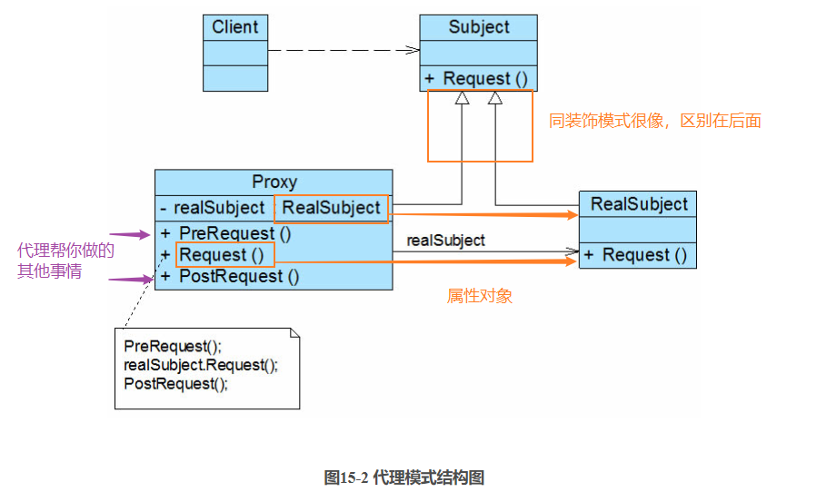

### 代理模式

**资料来源：**
[刘伟CSDN博客-模式](https://blog.csdn.net/lovelion/article/details/8227953)  
[图说设计模式-模式](https://design-patterns.readthedocs.io/zh_CN/latest/structural_patterns/proxy.html)

**核心简介：**
1. 当无法直接访问某个对象或访问某个对象存在困难时可以通过一个代理对象来间接访问

**个人理解：**
1. 装饰模式跟代理模式其实很像，两者的UML图其实差不多，但是区别还是有的：
	1. 装饰模式：增加的属性是自身的属性，在编程的后期，需要增强自身的功能，这个时候用装饰模式；比如汽车增加飞行的功能；
	2. 代理模式：利用代理，帮助你更全面的完成一件事，比如你是NBA球星，你的经纪人会帮助你找下家、签合同等等

**UML图**  



**代码实现：**

客户端测试代码如下：
```java
#include <iostream>
#include "RealSubject.h"
#include "Proxy.h"

using namespace std;

int main(int argc, char *argv[])
{
	Proxy proxy;
	proxy.request();
	
	return 0;
}
```


```java
///////////////////////////////////////////////////////////
//  Proxy.h
//  Implementation of the Class Proxy
//  Created on:      07-十月-2014 16:57:54
//  Original author: colin
///////////////////////////////////////////////////////////

#if !defined(EA_56011290_0413_40c6_9132_63EE89B023FD__INCLUDED_)
#define EA_56011290_0413_40c6_9132_63EE89B023FD__INCLUDED_

#include "RealSubject.h"
#include "Subject.h"

class Proxy : public Subject
{

public:
	Proxy();
	virtual ~Proxy();

	void request();

private:
	void afterRequest();
	void preRequest();	
	RealSubject *m_pRealSubject;

};
#endif // !defined(EA_56011290_0413_40c6_9132_63EE89B023FD__INCLUDED_)
```

```java
///////////////////////////////////////////////////////////
//  Proxy.cpp
//  Implementation of the Class Proxy
//  Created on:      07-十月-2014 16:57:54
//  Original author: colin
///////////////////////////////////////////////////////////

#include "Proxy.h"
#include <iostream>
using namespace std;


Proxy::Proxy(){
	//有人觉得 RealSubject对象的创建应该是在main中实现；我认为RealSubject应该
	//对用户是透明的，用户所面对的接口都是通过代理的；这样才是真正的代理； 
	m_pRealSubject = new RealSubject();
}

Proxy::~Proxy(){
	delete m_pRealSubject;
}

void Proxy::afterRequest(){
	cout << "Proxy::afterRequest" << endl;
}


void Proxy::preRequest(){
	cout << "Proxy::preRequest" << endl;
}


void Proxy::request(){
	preRequest();
	m_pRealSubject->request();
	afterRequest();
}
```

**场景：**
1. 远程代理为位于两个不同地址空间对象的访问提供了一种实现机制，可以将一些消耗资源较多的对象和操作移至性能更好的计算机上，提高系统的整体运行效率。
2. 虚拟代理通过一个消耗资源较少的对象来代表一个消耗资源较多的对象，可以在一定程度上节省系统的运行开销。
3. 缓冲代理为某一个操作的结果提供临时的缓存存储空间，以便在后续使用中能够共享这些结果，优化系统性能，缩短执行时间。
4. 保护代理可以控制对一个对象的访问权限，为不同用户提供不同级别的使用权限。

**开发中的应用场景：**
1. 安全代理：屏蔽对真实角色的直接访问
2. 远程代理：通过代理类处理远程方法调用（RMI）
3. 延迟加载：先加载轻量级的代理对象，真正需要再加载真实对象
4. struts2中拦截器的实现
5. 数据库连接池关闭处理
6. Hibernate中延时加载的实现
7. mybatis中实现拦截器插件
8. spring中AOP的实现
	1. 日志拦截
	2. 声明式事务处理
9. web serbice
10. RMI远程方法调用

**分类：**
1. 静态代理：我们自己定义代理类 
2. 动态代理：自动/动态生成代理类（√）
	1. ！代理的生成不用你管，由系统动态生成
	1. JDK自带的的动态代理
	2. javaassist字节码操作库实现
	3. CGLIB
	4. ASM

----

[回到目录](设计模式目录.md)