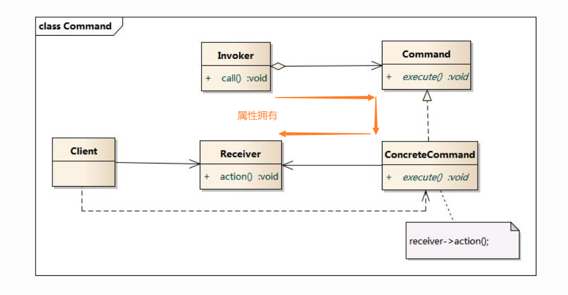

### 命令模式

**资料来源：**  
[图说设计模式-模式](https://design-patterns.readthedocs.io/zh_CN/latest/behavioral_patterns/command.html)
[刘伟CSDN博客-模式](https://blog.csdn.net/lovelion/article/details/17517213)

**核心简介：**
1. 将一个请求封装为一个对象，从而让我们可用不同的请求对客户进行参数化

**个人理解：**
1. 也同样是一条链；这么做的好处是，在客户端，你可以很灵活的选择接收者是谁，而不用一开始就被固定了

**UML图**  



**代码实现：**

客户端测试代码如下：
```java
#include <iostream>
#include "ConcreteCommand.h"
#include "Invoker.h"
#include "Receiver.h"

using namespace std;

int main(int argc, char *argv[])
{
	Receiver * pReceiver = new Receiver();
	ConcreteCommand * pCommand = new ConcreteCommand(pReceiver);
	Invoker * pInvoker = new Invoker(pCommand);
	pInvoker->call();
	
	delete pReceiver;
	delete pCommand;
	delete pInvoker;
	return 0;
}
```


```java
///////////////////////////////////////////////////////////
//  Receiver.h
//  Implementation of the Class Receiver
//  Created on:      07-十月-2014 17:44:02
//  Original author: colin
///////////////////////////////////////////////////////////

#if !defined(EA_8E5430BB_0904_4a7d_9A3B_7169586237C8__INCLUDED_)
#define EA_8E5430BB_0904_4a7d_9A3B_7169586237C8__INCLUDED_

class Receiver
{

public:
	Receiver();
	virtual ~Receiver();

	void action();

};
#endif // !defined(EA_8E5430BB_0904_4a7d_9A3B_7169586237C8__INCLUDED_)
```

```java
///////////////////////////////////////////////////////////
//  Receiver.cpp
//  Implementation of the Class Receiver
//  Created on:      07-十月-2014 17:44:02
//  Original author: colin
///////////////////////////////////////////////////////////

#include "Receiver.h"
#include <iostream>
using namespace std;

Receiver::Receiver(){

}

Receiver::~Receiver(){

}

void Receiver::action(){
	cout << "receiver action." << endl;
}
```

```java
///////////////////////////////////////////////////////////
//  ConcreteCommand.h
//  Implementation of the Class ConcreteCommand
//  Created on:      07-十月-2014 17:44:01
//  Original author: colin
///////////////////////////////////////////////////////////

#if !defined(EA_1AE70D53_4868_4e81_A1B8_1088DA355C23__INCLUDED_)
#define EA_1AE70D53_4868_4e81_A1B8_1088DA355C23__INCLUDED_

#include "Command.h"
#include "Receiver.h"

class ConcreteCommand : public Command
{

public:
	ConcreteCommand(Receiver * pReceiver);
	virtual ~ConcreteCommand();
	virtual void execute();
private:
	Receiver *m_pReceiver;


};
#endif // !defined(EA_1AE70D53_4868_4e81_A1B8_1088DA355C23__INCLUDED_)
```

```java
///////////////////////////////////////////////////////////
//  ConcreteCommand.cpp
//  Implementation of the Class ConcreteCommand
//  Created on:      07-十月-2014 17:44:02
//  Original author: colin
///////////////////////////////////////////////////////////

#include "ConcreteCommand.h"
#include <iostream>
using namespace std;


ConcreteCommand::ConcreteCommand(Receiver *pReceiver){
	m_pReceiver = pReceiver;
}


ConcreteCommand::~ConcreteCommand(){

}

void ConcreteCommand::execute(){
	cout << "ConcreteCommand::execute"  << endl;
	m_pReceiver->action();
}
```

```java
///////////////////////////////////////////////////////////
//  Invoker.h
//  Implementation of the Class Invoker
//  Created on:      07-十月-2014 17:44:02
//  Original author: colin
///////////////////////////////////////////////////////////

#if !defined(EA_3DACB62A_0813_4d11_8A82_10BF1FB00D9A__INCLUDED_)
#define EA_3DACB62A_0813_4d11_8A82_10BF1FB00D9A__INCLUDED_

#include "Command.h"

class Invoker
{

public:
	Invoker(Command * pCommand);
	virtual ~Invoker();
	void call();

private:
	Command *m_pCommand;


};
#endif // !defined(EA_3DACB62A_0813_4d11_8A82_10BF1FB00D9A__INCLUDED_)
```

```java
///////////////////////////////////////////////////////////
//  Invoker.cpp
//  Implementation of the Class Invoker
//  Created on:      07-十月-2014 17:44:02
//  Original author: colin
///////////////////////////////////////////////////////////

#include "Invoker.h"
#include <iostream>
using namespace std;

Invoker::Invoker(Command * pCommand){
	m_pCommand = pCommand;
}

Invoker::~Invoker(){

}

void Invoker::call(){
	cout << "invoker calling" << endl;
	m_pCommand->execute();
}
```

----

[回到目录](设计模式目录.md)