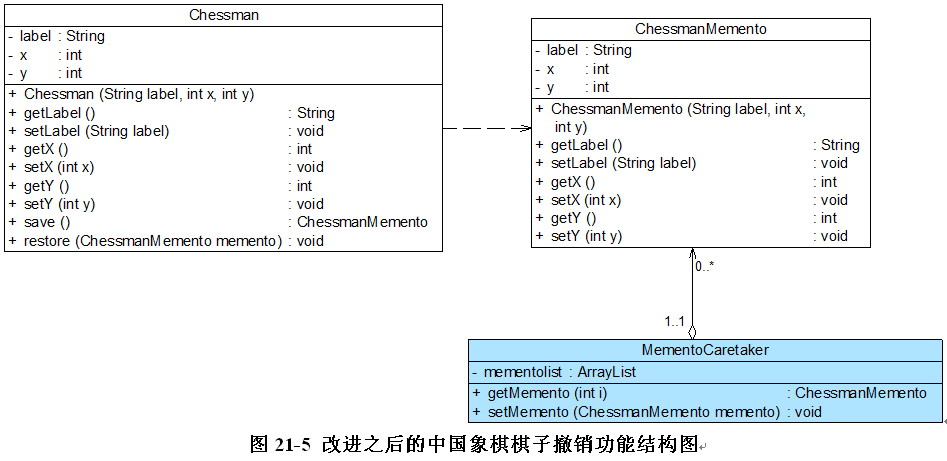

### 备忘录模式

**资料来源：**
[刘伟CSDN博客-模式](https://blog.csdn.net/lovelion/article/details/7526740)  

**核心简介：**
1. 在不破坏封装的前提下，捕获一个对象的内部状态，并在该对象之外保存这个状态，这样可以在以后将对象恢复到原先保存的状态。

**个人理解：**
1. 每一步Originator都是一个记录，存到Caretaker的List中
2. 如果要回退到历史记录，那么Originator接收Caretaker中的对象

**UML图**  


**举例应用：**

中国象棋棋子撤销功能



**代码实现：**

客户端测试代码如下：
```java
class Client {
private static int index = -1; //定义一个索引来记录当前状态所在位置
	private static MementoCaretaker mc = new MementoCaretaker();
 
	public static void main(String args[]) {
		Chessman chess = new Chessman("车",1,1);
		play(chess);		
		chess.setY(4);
		play(chess);
		chess.setX(5);
		play(chess);	
		undo(chess,index);
		undo(chess,index);	
		redo(chess,index);
		redo(chess,index);
	}
	
    //下棋
	public static void play(Chessman chess) {
		mc.setMemento(chess.save()); //保存备忘录
		index ++; 
		System.out.println("棋子" + chess.getLabel() + "当前位置为：" + "第" + chess.getX() + "行" + "第" + chess.getY() + "列。");
	}
 
	//悔棋
	public static void undo(Chessman chess,int i) {
		System.out.println("******悔棋******");
		index --; 
		chess.restore(mc.getMemento(i-1)); //撤销到上一个备忘录
		System.out.println("棋子" + chess.getLabel() + "当前位置为：" + "第" + chess.getX() + "行" + "第" + chess.getY() + "列。");
	}
 
	//撤销悔棋
	public static void redo(Chessman chess,int i) {
		System.out.println("******撤销悔棋******");	
		index ++; 
		chess.restore(mc.getMemento(i+1)); //恢复到下一个备忘录
		System.out.println("棋子" + chess.getLabel() + "当前位置为：" + "第" + chess.getX() + "行" + "第" + chess.getY() + "列。");
	}
} 
```


```java
//象棋棋子类：原发器
class Chessman {
	private String label;
	private int x;
	private int y;
 
	public Chessman(String label,int x,int y) {
		this.label = label;
		this.x = x;
		this.y = y;
	}
 
	public void setLabel(String label) {
		this.label = label; 
	}
 
	public void setX(int x) {
		this.x = x; 
	}
 
	public void setY(int y) {
		this.y = y; 
	}
 
	public String getLabel() {
		return (this.label); 
	}
 
	public int getX() {
		return (this.x); 
	}
 
	public int getY() {
		return (this.y); 
	}
	
    //保存状态
	public ChessmanMemento save() {
		return new ChessmanMemento(this.label,this.x,this.y);
	}
	
    //恢复状态
	public void restore(ChessmanMemento memento) {
		this.label = memento.getLabel();
		this.x = memento.getX();
		this.y = memento.getY();
	}
}


```

编译并运行程序，输出结果如下：
> 棋子车当前位置为：第1行第1列。
> 棋子车当前位置为：第1行第4列。
> 棋子车当前位置为：第5行第4列。
> ******悔棋******
> 棋子车当前位置为：第1行第4列。
> ******悔棋******
> 棋子车当前位置为：第1行第1列。
> ******撤销悔棋******
> 棋子车当前位置为：第1行第4列。
> ******撤销悔棋******
> 棋子车当前位置为：第5行第4列。

**场景：**
1. PS的历史记录
2. Ctrl + Z

**开发中的应用场景：**
1. 棋类游戏中的，悔棋
2. 数据库软件中，事务管理的回滚操作


----

[回到目录](设计模式目录.md)