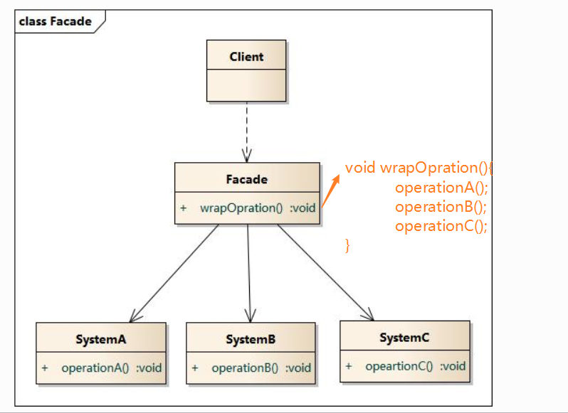

### 外观模式

**资料来源：**
[图说设计模式-模式](https://design-patterns.readthedocs.io/zh_CN/latest/structural_patterns/facade.html)
[刘伟CSDN博客-模式](https://blog.csdn.net/lovelion/article/details/8258121)  

**核心简介：**
1. 外观模式定义了一个高层接口，这个接口使得这一子系统更加容易使用。
2. 为子系统中的一组接口提供一个统一的入口。
3. 迪米特法则（最少知识原则）
一个软件实体应当尽可能少的与其他实体发生相互作用

**个人理解：**
1. 外观模式类将子类作为属性
2. 并将子类的方法合并成一个方法/外界只需要跟外观模式类打交道就可以跟所有的子类打交道

**UML图**  



**代码实现：**

客户端测试代码如下：
```java
#include <iostream>
#include "Facade.h"
using namespace std;

int main(int argc, char *argv[])
{
	Facade fa;
	fa.wrapOpration();
	
	return 0;
}
```

```java
///////////////////////////////////////////////////////////
//  Facade.h
//  Implementation of the Class Facade
//  Created on:      06-十月-2014 19:10:44
//  Original author: colin
///////////////////////////////////////////////////////////

#if !defined(EA_FD130A87_92A9_4168_9B33_7A925C47AFD5__INCLUDED_)
#define EA_FD130A87_92A9_4168_9B33_7A925C47AFD5__INCLUDED_

#include "SystemC.h"
#include "SystemA.h"
#include "SystemB.h"

class Facade
{

public:
	Facade();
	virtual ~Facade();

	void wrapOpration();

private:
	SystemC *m_SystemC;
	SystemA *m_SystemA;
	SystemB *m_SystemB;
};
#endif // !defined(EA_FD130A87_92A9_4168_9B33_7A925C47AFD5__INCLUDED_)
```

```java
///////////////////////////////////////////////////////////
//  Facade.cpp
//  Implementation of the Class Facade
//  Created on:      06-十月-2014 19:10:44
//  Original author: colin
///////////////////////////////////////////////////////////

#include "Facade.h"


Facade::Facade(){
	m_SystemA  = new SystemA();
	m_SystemB = new SystemB();
	m_SystemC = new SystemC();
}


Facade::~Facade(){
	delete m_SystemA;
	delete m_SystemB;
	delete m_SystemC;
}

void Facade::wrapOpration(){
	m_SystemA->operationA();
	m_SystemB->operationB();
	m_SystemC->opeartionC();
}
```

**场景：**
1. 外观模式其实在我们的程序开发中非常非常的常见 


----

[回到目录](设计模式目录.md)