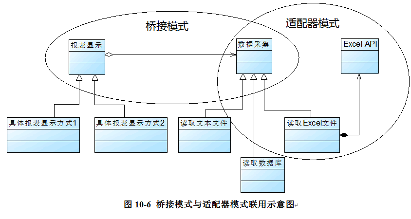

### 桥接模式

资料来源：
[刘伟CSDN博客-桥接模式](https://blog.csdn.net/lovelion/article/details/7464183)  
[图说设计模式-桥接模式](https://design-patterns.readthedocs.io/zh_CN/latest/structural_patterns/bridge.html)

**核心简介：**
1. 桥接模式尤其适用于：一个类存在两个（或多个）独立变化的维度，且这两个维度都需要进行拓展

**个人理解：**
1. 桥接模式和适配器模式其实很像，区别在于（后面有给图说明出来）  
	- 适配器模式下：一个**实现类（U盘）**是当作另一个**实现类**的属性
	- 桥接模式下：一个**抽象类（另一个维度）**是当作另一个**抽象类**的属性

**UML图**  
桥接模式_UML实例理解图：


**举例应用：**

跨平台图像浏览系统
 Sunny软件公司欲开发一个跨平台图像浏览系统，要求该系统能够显示BMP、JPG、GIF、PNG等多种格式的文件，并且能够在Windows、Linux、Unix等多个操作系统上运行。系统首先将各种格式的文件解析为像素矩阵(Matrix)，然后将像素矩阵显示在屏幕上，在不同的操作系统中可以调用不同的绘制函数来绘制像素矩阵。系统需具有较好的扩展性以支持新的文件格式和操作系统。


**代码实现：**

客户端测试代码如下：
```java
class Client {
	public static void main(String args[]) {
		Image image;
		ImageImp imp;
		image = (Image)XMLUtil.getBean("image");
		imp = (ImageImp)XMLUtil.getBean("os");
		image.setImageImp(imp);
		image.parseFile("小龙女");
	}
}
```

Image充当抽象类，其子类JPGImage、PNGImage、BMPImage和GIFImage充当扩充抽象类；ImageImp充当实现类接口，其子类WindowsImp、LinuxImp和UnixImp充当具体实现类。完整代码如下所示：
```java
//像素矩阵类：辅助类，各种格式的文件最终都被转化为像素矩阵，不同的操作系统提供不同的方式显示像素矩阵
class Matrix {
	//此处代码省略
}
 
//抽象图像类：抽象类
abstract class Image {
	protected ImageImp imp;
 
	public void setImageImp(ImageImp imp) {
		this.imp = imp;
	} 
 
	public abstract void parseFile(String fileName);
}
 
//抽象操作系统实现类：实现类接口
interface ImageImp {
	public void doPaint(Matrix m);  //显示像素矩阵m
} 
 
//Windows操作系统实现类：具体实现类
class WindowsImp implements ImageImp {
    public void doPaint(Matrix m) {
    	//调用Windows系统的绘制函数绘制像素矩阵
    	System.out.print("在Windows操作系统中显示图像：");
    }
}
 
//Linux操作系统实现类：具体实现类
class LinuxImp implements ImageImp {
    public void doPaint(Matrix m) {
    	//调用Linux系统的绘制函数绘制像素矩阵
    	System.out.print("在Linux操作系统中显示图像：");
    }
}
 
//Unix操作系统实现类：具体实现类
class UnixImp implements ImageImp {
    public void doPaint(Matrix m) {
    	//调用Unix系统的绘制函数绘制像素矩阵
    	System.out.print("在Unix操作系统中显示图像：");
    }
}
 
//JPG格式图像：扩充抽象类
class JPGImage extends Image {
	public void parseFile(String fileName) {
        //模拟解析JPG文件并获得一个像素矩阵对象m;
        Matrix m = new Matrix(); 
        imp.doPaint(m);
        System.out.println(fileName + "，格式为JPG。");
    }
}
 
//PNG格式图像：扩充抽象类
class PNGImage extends Image {
	public void parseFile(String fileName) {
        //模拟解析PNG文件并获得一个像素矩阵对象m;
        Matrix m = new Matrix(); 
        imp.doPaint(m);
        System.out.println(fileName + "，格式为PNG。");
    }
}
 
//BMP格式图像：扩充抽象类
class BMPImage extends Image {
	public void parseFile(String fileName) {
        //模拟解析BMP文件并获得一个像素矩阵对象m;
        Matrix m = new Matrix(); 
        imp.doPaint(m);
        System.out.println(fileName + "，格式为BMP。");
    }
}
 
//GIF格式图像：扩充抽象类
class GIFImage extends Image {
	public void parseFile(String fileName) {
        //模拟解析GIF文件并获得一个像素矩阵对象m;
        Matrix m = new Matrix(); 
        imp.doPaint(m);
        System.out.println(fileName + "，格式为GIF。");
    }
}
```

为了让系统具有更好的灵活性和可扩展性，我们引入了配置文件，将具体扩充抽象类和具体实现类类名都存储在配置文件中，再通过反射生成对象，将生成的具体实现类对象注入到扩充抽象类对象中，其中，配置文件config.xml的代码如下所示：

```java
<?xml version="1.0"?>
<config>
	<!--RefinedAbstraction-->
	<className>JPGImage</className> 
	<!--ConcreteImplementor-->
	<className>WindowsImp</className>
</config>
```

用于读取配置文件config.xml并反射生成对象的XMLUtil类的代码如下所示：
```java
import javax.xml.parsers.*;
import org.w3c.dom.*;
import org.xml.sax.SAXException;
import java.io.*;
public class XMLUtil {
//该方法用于从XML配置文件中提取具体类类名，并返回一个实例对象
	public static Object getBean(String args) {
		try {
			//创建文档对象
			DocumentBuilderFactory dFactory = DocumentBuilderFactory.newInstance();
			DocumentBuilder builder = dFactory.newDocumentBuilder();
			Document doc;							
			doc = builder.parse(new File("config.xml")); 
			NodeList nl=null;
			Node classNode=null;
			String cName=null;
			nl = doc.getElementsByTagName("className");
			
			if(args.equals("image")) {
				//获取第一个包含类名的节点，即扩充抽象类
	            classNode=nl.item(0).getFirstChild();
	            
			}
			else if(args.equals("os")) {
			   //获取第二个包含类名的节点，即具体实现类
	            classNode=nl.item(1).getFirstChild();
			}
			
	         cName=classNode.getNodeValue();
	         //通过类名生成实例对象并将其返回
	         Class c=Class.forName(cName);
		  	 Object obj=c.newInstance();
	         return obj;		
           }   
           catch(Exception e) {
              e.printStackTrace();
              return null;
          }
     }
}
```

编译并运行程序，输出结果如下：
> 在Windows操作系统中显示图像：小龙女，格式为JPG。

**桥接模式和适配器模式区别：**



**场景：**
1. 商城系统中常用的商品分类--多层继承结构

**开发中的应用场景：**
1. JDBC驱动程序
2. AWT中Peer架构
3. 银行日志管理
	1. 格式分类：操作日志、交易日志、异常日志
	2. 距离分类：本地记录日志、异地记录日志
3. 有多个维度的系统

----

[回到目录](设计模式目录.md)