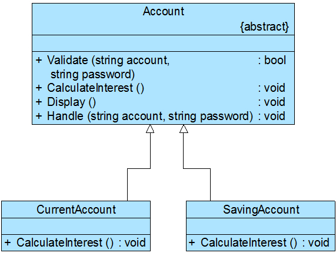

### 模板方法模式

**资料来源：**
[刘伟CSDN博客-模式]()  
[图说设计模式-模式]()

**核心简介：**
1. 定义一个操作中算法的框架，而将一些步骤延迟到子类中。模板方法模式使得子类可以不改变一个算法的结构即可重定义该算法的某些特定步骤。

**个人理解：**
1. ~

**UML图**  


**举例应用：**

某软件公司欲为某银行的业务支撑系统开发一个利息计算模块，利息计算流程如下：
      (1) 系统根据账号和密码验证用户信息，如果用户信息错误，系统显示出错提示；
      (2) 如果用户信息正确，则根据用户类型的不同使用不同的利息计算公式计算利息（如活期账户和定期账户具有不同的利息计算公式）；
      (3) 系统显示利息。
      试使用模板方法模式设计该利息计算模块。



**代码实现：**

客户端测试代码如下：
```java
//Program.cs
using System;
using System.Configuration;
using System.Reflection;
 
namespace TemplateMethodSample
{
    class Program
    {
        static void Main(string[] args)
        {
            Account account;
            //读取配置文件
            string subClassStr = ConfigurationManager.AppSettings["subClass"];
            //反射生成对象
            account = (Account)Assembly.Load("TemplateMethodSample").CreateInstance(subClassStr);
            account.Handle("张无忌", "123456");
            Console.Read();
        }
    }
}
```
Account：账户类，充当抽象类。

```java
//Account.cs
using System;
 
namespace TemplateMethodSample
{
    abstract class Account
    {
        //基本方法——具体方法
        public bool Validate(string account, string password) 
        {
		    Console.WriteLine("账号：{0}", account);
            Console.WriteLine("密码：{0}", password);
            //模拟登录
            if (account.Equals("张无忌") && password.Equals("123456")) 
            {
			    return true;
		    }
		    else 
            {
			    return false;
		    }
	    }
 
        //基本方法——抽象方法
        public abstract void CalculateInterest();
 
        //基本方法——具体方法
        public void Display() 
        {
            Console.WriteLine("显示利息！");
	    }
 
        //模板方法
        public void Handle(string account, string password) 
        {
		    if (!Validate(account,password)) 
            {
                Console.WriteLine("账户或密码错误！");
			    return;
		    }
		    CalculateInterest();
		    Display();
	    }
    }
}
```
CurrentAccount：活期账户类，充当具体子类。
```java
//CurrentAccount.cs
using System;
 
namespace TemplateMethodSample
{
    class CurrentAccount : Account
    {
        //覆盖父类的抽象基本方法
        public override void CalculateInterest() 
        {
		    Console.WriteLine("按活期利率计算利息！");
	    }
    }
}
```
SavingAccount：定期账户类，充当具体子类。
```java
//SavingAccount.cs
using System;
 
namespace TemplateMethodSample
{
    class SavingAccount : Account
    {
        //覆盖父类的抽象基本方法
        public override void CalculateInterest() 
        {
		    Console.WriteLine("按定期利率计算利息！");
	    }
    }
}
```
配置文件App.config，在配置文件中存储了具体子类的类名。
```java
<?xml version="1.0" encoding="utf-8" ?>
<configuration>
  <appSettings>
    <add key="subClass" value="TemplateMethodSample.CurrentAccount"/>
  </appSettings>
</configuration>
```

编译并运行程序，输出结果如下：
> 账号：张无忌
> 
> 密码：123456
> 
> 按活期利率计算利息！
> 
> 显示利息！

**开发中的应用场景：**
1. 实现一个算法时，整体步骤很固定，但是，某些部分易变。易变部分可以抽象出来，供子类重写实现
2. 数据库访问的封装
3. Junit单元测试
4. servlet中关于doGet/doPost方法调用
5. Hibernate模板程序
6. spring中JDBCTemplate、HibernateTemplate

核心：
 处理步骤父类中定义好，具体实现延迟到子类中定义

**方法回调（钩子方法）**
1. 好莱坞原则：Don't call me, we'll call you back.
	1. 即：子类不能调用父类，而通过父类调用子类。这些调用步骤已经在父类中写好了，完全由父类控制整个过程


----

[回到目录](设计模式目录.md)