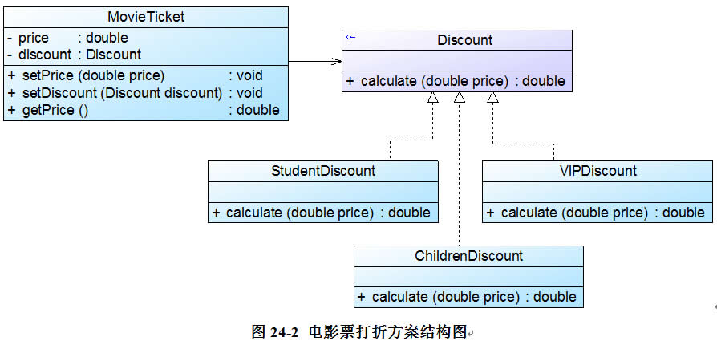

### 策略模式

**资料来源：**
[刘伟CSDN博客-模式](https://blog.csdn.net/lovelion/article/details/7818983)  

**核心简介：**
1. 策略模式是直接依赖注入到Context类的参数进行选择策略，不存在切换状态的操作。 

**个人理解：**
1. 跟状态模式很像，策略模式是直接依赖注入到Context类的参数进行选择策略，不存在切换状态的操作。 

**UML图**  


**举例应用：**

 为了实现打折算法的复用，并能够灵活地向系统中增加新的打折方式，Sunny软件公司开发人员使用策略模式对电影院打折方案进行重构



**代码实现：**

客户端测试代码如下：
```java
class Client {
	public static void main(String args[]) {
		MovieTicket mt = new MovieTicket();
		double originalPrice = 60.0;
		double currentPrice;
		
		mt.setPrice(originalPrice);
		System.out.println("原始价为：" + originalPrice);
		System.out.println("---------------------------------");
			
		Discount discount;
		discount = (Discount)XMLUtil.getBean(); //读取配置文件并反射生成具体折扣对象
		mt.setDiscount(discount); //注入折扣对象
		
		currentPrice = mt.getPrice();
		System.out.println("折后价为：" + currentPrice);
	}
}
```
MovieTicket充当环境类角色，Discount充当抽象策略角色，StudentDiscount、 ChildrenDiscount 和VIPDiscount充当具体策略角色。

```java
//电影票类：环境类
class MovieTicket {
	private double price;
	private Discount discount; //维持一个对抽象折扣类的引用
 
	public void setPrice(double price) {
		this.price = price;
	}
 
    //注入一个折扣类对象
	public void setDiscount(Discount discount) {
		this.discount = discount;
	}
 
	public double getPrice() {
        //调用折扣类的折扣价计算方法
		return discount.calculate(this.price);
	}
}
 
//折扣类：抽象策略类
interface Discount {
	public double calculate(double price);
}
 
//学生票折扣类：具体策略类
class StudentDiscount implements Discount {
	public double calculate(double price) {
		System.out.println("学生票：");
		return price * 0.8;
	}
} 
 
//儿童票折扣类：具体策略类
class ChildrenDiscount implements Discount {
	public double calculate(double price) {
		System.out.println("儿童票：");
		return price - 10;
	}
} 
 
//VIP会员票折扣类：具体策略类
class VIPDiscount implements Discount {
	public double calculate(double price) {
		System.out.println("VIP票：");
		System.out.println("增加积分！");
		return price * 0.5;
	}
}
```
为了提高系统的灵活性和可扩展性，我们将具体策略类的类名存储在配置文件中，并通过工具类XMLUtil来读取配置文件并反射生成对象，XMLUtil类的代码如下所示：
```java
import javax.xml.parsers.*;
import org.w3c.dom.*;
import org.xml.sax.SAXException;
import java.io.*;
class XMLUtil {
//该方法用于从XML配置文件中提取具体类类名，并返回一个实例对象
	public static Object getBean() {
		try {
			//创建文档对象
			DocumentBuilderFactory dFactory = DocumentBuilderFactory.newInstance();
			DocumentBuilder builder = dFactory.newDocumentBuilder();
			Document doc;							
			doc = builder.parse(new File("config.xml")); 
		
			//获取包含类名的文本节点
			NodeList nl = doc.getElementsByTagName("className");
            Node classNode=nl.item(0).getFirstChild();
            String cName=classNode.getNodeValue();
            
            //通过类名生成实例对象并将其返回
            Class c=Class.forName(cName);
	  	    Object obj=c.newInstance();
            return obj;
        }   
        catch(Exception e) {
           	e.printStackTrace();
           	return null;
       	}
    }
}
```
在配置文件config.xml中存储了具体策略类的类名，代码如下所示：
```java
<?xml version="1.0"?>
<config>
    <className>StudentDiscount</className>
</config>
```

编译并运行程序，输出结果如下：
> 

**开发中的应用场景：**
1. Spring框架中，Resource接口，资源访问策略

**策略模式和状态模式：**

区别：状态模式将各个状态所对应的操作分离开来，即对于不同的状态，由不同的子类实现具体操作，不同状态的切换由子类实现，当发现传入参数不是自己这个状态所对应的参数，则自己给Context类切换状态；而策略模式是直接依赖注入到Context类的参数进行选择策略，不存在切换状态的操作。 
 
联系：状态模式和策略模式都是为具有多种可能情形设计的模式，把不同的处理情形抽象为一个相同的接口，符合对扩展开放，对修改封闭的原则。还有就是，策略模式更具有一般性一些，在实践中，可以用策略模式来封装几乎任何类型的规则，只要在分析过程中听到需要在不同实践应用不同的业务规则，就可以考虑使用策略模式处理，在这点上策略模式是包含状态模式的功能的，策略模式是一个重要的设计模式。

作者：海公公
链接：https://www.zhihu.com/question/23693088/answer/25364323
来源：知乎
著作权归作者所有。商业转载请联系作者获得授权，非商业转载请注明出处。

----

[回到目录](设计模式目录.md)