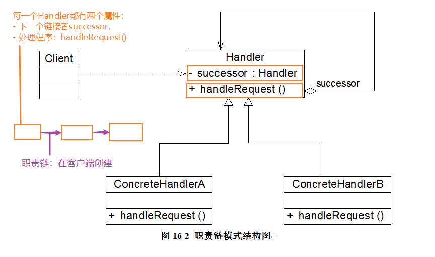
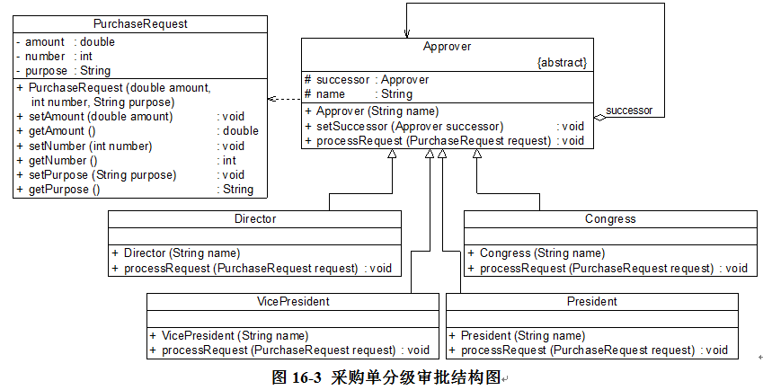

### 职责链

**资料来源：**
[刘伟CSDN博客-模式](https://blog.csdn.net/lovelion/article/details/7420891)  

**核心简介：**
1. 让多个对象都有可能接收请求，将这些对象连接成一条链，并且沿着这条链传递请求，直到有对象处理它为止。
2. 一般是在使用该职责链的客户端中创建职责链。

**个人理解：**
1. 职责链的大体认识：一个职责链对象Handler都有：本身能够的处理程序 + 下一个处理者
	1. 职责链的链接：在客户端创建
	2. 处理程序：职责链对象Handler的实现类各自实现：ConcreteHandlerA、ConcreteHandlerB

**UML图**  



**举例应用：**

 为了让采购单的审批流程更加灵活，并实现采购单的链式传递和处理，Sunny公司开发人员使用职责链模式来实现采购单的分级审批



**代码实现：**

客户端测试代码如下：
```java
lass Client {
	public static void main(String[] args) {
		Approver wjzhang,gyang,jguo,meeting;
		wjzhang = new Director("张无忌");
		gyang = new VicePresident("杨过");
		jguo = new President("郭靖");
		meeting = new Congress("董事会");
	
		//创建职责链
		wjzhang.setSuccessor(gyang);
		gyang.setSuccessor(jguo);
		jguo.setSuccessor(meeting);
		
		//创建采购单
		PurchaseRequest pr1 = new PurchaseRequest(45000,10001,"购买倚天剑");
		wjzhang.processRequest(pr1);
		
		PurchaseRequest pr2 = new PurchaseRequest(60000,10002,"购买《葵花宝典》");
		wjzhang.processRequest(pr2);
	
		PurchaseRequest pr3 = new PurchaseRequest(160000,10003,"购买《金刚经》");
		wjzhang.processRequest(pr3);
 
		PurchaseRequest pr4 = new PurchaseRequest(800000,10004,"购买桃花岛");
		wjzhang.processRequest(pr4);
	}
} 
```


```java
//采购单：请求类
class PurchaseRequest {
	private double amount;  //采购金额
	private int number;  //采购单编号
	private String purpose;  //采购目的
	
	public PurchaseRequest(double amount, int number, String purpose) {
		this.amount = amount;
		this.number = number;
		this.purpose = purpose;
	}
	
	public void setAmount(double amount) {
		this.amount = amount;
	}
	
	public double getAmount() {
		return this.amount;
	}
	
	public void setNumber(int number) {
		this.number = number;
	}
	
	public int getNumber() {
		return this.number;
	}
	
	public void setPurpose(String purpose) {
		this.purpose = purpose;
	}
	
	public String getPurpose() {
		return this.purpose;
	}
}
 
//审批者类：抽象处理者
abstract class Approver {
	protected Approver successor; //定义后继对象
	protected String name; //审批者姓名
	
	public Approver(String name) {
		this.name = name;
	}
 
	//设置后继者
	public void setSuccessor(Approver successor) { 
		this.successor = successor;
	}
 
    //抽象请求处理方法
    public abstract void processRequest(PurchaseRequest request);
}
 
//主任类：具体处理者
class Director extends Approver {
	public Director(String name) {
		super(name);
	}
	
    //具体请求处理方法
 	public void processRequest(PurchaseRequest request) {
 		if (request.getAmount() < 50000) {
 			System.out.println("主任" + this.name + "审批采购单：" + request.getNumber() + "，金额："
			 	+ request.getAmount() + "元，采购目的：" + request.getPurpose() + "。");  //处理请求
 		}
 		else {
 			this.successor.processRequest(request);  //转发请求
 		}	
 	}
}
 
//副董事长类：具体处理者
class VicePresident extends Approver {
	public VicePresident(String name) {
		super(name);
	}
	
    //具体请求处理方法
 	public void processRequest(PurchaseRequest request) {
 		if (request.getAmount() < 100000) {
 			System.out.println("副董事长" + this.name + "审批采购单：" + request.getNumber() + "，金额：" 
				+ request.getAmount() + "元，采购目的：" + request.getPurpose() + "。");  //处理请求
 		}
 		else {
 			this.successor.processRequest(request);  //转发请求
 		}	
 	}
}
 
//董事长类：具体处理者
class President extends Approver {
	public President(String name) {
		super(name);
	}
	
    //具体请求处理方法
 	public void processRequest(PurchaseRequest request) {
 		if (request.getAmount() < 500000) {
 			System.out.println("董事长" + this.name + "审批采购单：" + request.getNumber() + "，金额：" 
				+ request.getAmount() + "元，采购目的：" + request.getPurpose() + "。");  //处理请求
 		}
 		else {
 			this.successor.processRequest(request);  //转发请求
 		}
 	}
}
 
//董事会类：具体处理者
class Congress extends Approver {
	public Congress(String name) {
		super(name);
	}
	
    //具体请求处理方法
 	public void processRequest(PurchaseRequest request) {
 		System.out.println("召开董事会审批采购单：" + request.getNumber() + "，金额：" + 
			request.getAmount() + "元，采购目的：" + request.getPurpose() + "。");	    //处理请求
 	}    
}
```

编译并运行程序，输出结果如下：
> 主任张无忌审批采购单：10001，金额：45000.0元，采购目的：购买倚天剑。
> 副董事长杨过审批采购单：10002，金额：60000.0元，采购目的：购买《葵花宝典》。
> 董事长郭靖审批采购单：10003，金额：160000.0元，采购目的：购买《金刚经》。
> 召开董事会审批采购单：10004，金额：800000.0元，采购目的：购买桃花岛。

**开发中的应用场景：**
1. 异常机制try catch
2. servlet开发中，过滤器的链式处理
3. Struts2，拦截器也是责任链

----

[回到目录](设计模式目录.md)