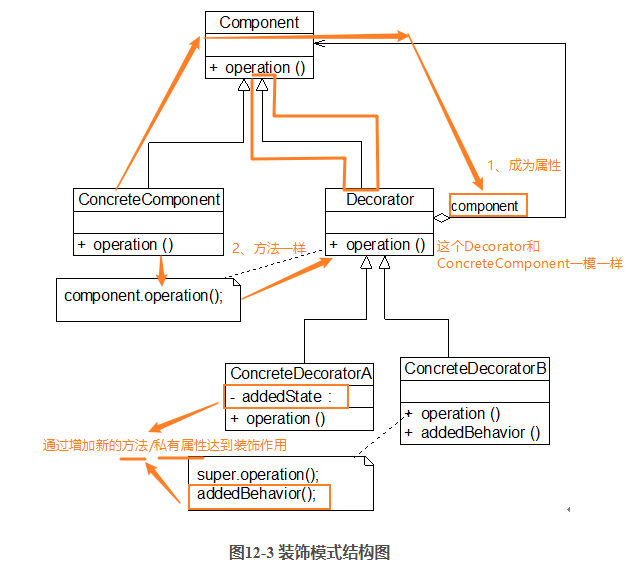

### 装饰模式

**资料来源**：
[刘伟CSDN博客-模式](https://blog.csdn.net/lovelion/article/details/7424685)  
[图说设计模式-模式](https://design-patterns.readthedocs.io/zh_CN/latest/structural_patterns/decorator.html)

**核心简介：**
1. 装饰模式的作用同名字一样，通过一个装饰器来增加原有系统的功能；
2. 通过装饰器模式可以降低系统的耦合度，可以动态的增加或删除对象的职责

**个人理解：**
1. 典型的装饰器可以联想BufferStream
2. 装饰器继承于公共的父类，所以说到底：装饰器还是原来的父类：
3. 装饰器通过增加新的方法/私有属性来达到装饰的作用


**UML图**  



**举例应用：**

 Sunny软件公司基于面向对象技术开发了一套图形界面构件库VisualComponent，该构件库提供了大量基本构件，如窗体、文本框、列表框等，由于在使用该构件库时，用户经常要求定制一些特效显示效果，如带滚动条的窗体、带黑色边框的文本框、既带滚动条又带黑色边框的列表框等等，因此经常需要对该构件库进行扩展以增强其功能


**代码实现：**

客户端测试代码如下：
```java
class Client

{

       public  static void main(String args[])

       {

              Component component,componentSB;  //使用抽象构件定义；共同父类一样

              component = new Window(); //定义具体构件

              componentSB = new  ScrollBarDecorator(component); //定义装饰后的构件

              componentSB.display();

       }

}
```
Component充当抽象构件类，其子类Window、TextBox、ListBox充当具体构件类，Component类的另一个子类ComponentDecorator充当抽象装饰类，ComponentDecorator的子类ScrollBarDecorator和BlackBorderDecorator充当具体装饰类。

```java
//抽象界面构件类：抽象构件类，为了突出与模式相关的核心代码，对原有控件代码进行了大量的简化

abstract class Component

{

       public  abstract void display();

}

 

//窗体类：具体构件类

class Window extends Component

{

       public  void display()

       {

              System.out.println("显示窗体！");

       }

}

 

//文本框类：具体构件类

class TextBox extends Component

{

       public  void display()

       {

              System.out.println("显示文本框！");

       }

}

 

//列表框类：具体构件类

class ListBox extends Component

{

       public  void display()

       {

              System.out.println("显示列表框！");

       }

}

 

//构件装饰类：抽象装饰类

class ComponentDecorator extends Component

{

       private Component component;  //维持对抽象构件类型对象的引用

 

       public ComponentDecorator(Component  component)  //注入抽象构件类型的对象

       {

              this.component = component;

       }

 

       public void display()

       {

              component.display();

       }

}

 

//滚动条装饰类：具体装饰类

class ScrollBarDecorator extends  ComponentDecorator

{

       public ScrollBarDecorator(Component  component)

       {

              super(component);

       }

 

       public void display()

       {

              this.setScrollBar();

              super.display();

       }

 

       public  void setScrollBar()

       {

              System.out.println("为构件增加滚动条！");

       }

}

 

//黑色边框装饰类：具体装饰类

class BlackBorderDecorator extends  ComponentDecorator

{

       public BlackBorderDecorator(Component  component)

       {

              super(component);

       }

 

       public void display()

       {

              this.setBlackBorder();

              super.display();

       }

 

       public  void setBlackBorder()

       {

              System.out.println("为构件增加黑色边框！");

       }

}
```

编译并运行程序，输出结果如下：
> 为构件增加黑色边框！
> 为构件增加滚动条！
> 显示窗体

**开发中的应用场景：**
1. IO输入流和输出流的设计
2. Servlet API中提供的一个request对象的Decorator设计模式的默认实现类HttpServletRequestWrapper,HttpServletRequestWrapper类，增强了request对象的功能（看到Wrapper就是装饰器）
3. Struts2中，request，response，session对象的处理

**装饰模式和桥接模式的区别：**
- 两个模式都是为了解决过多子类对象问题。但是他们看待问题的角度不一样。桥接模式是现有机制沿着多个维度变化，而装饰模式是为了增加新的功能

----

[回到目录](设计模式目录.md)