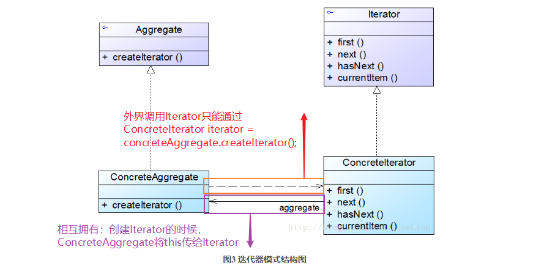
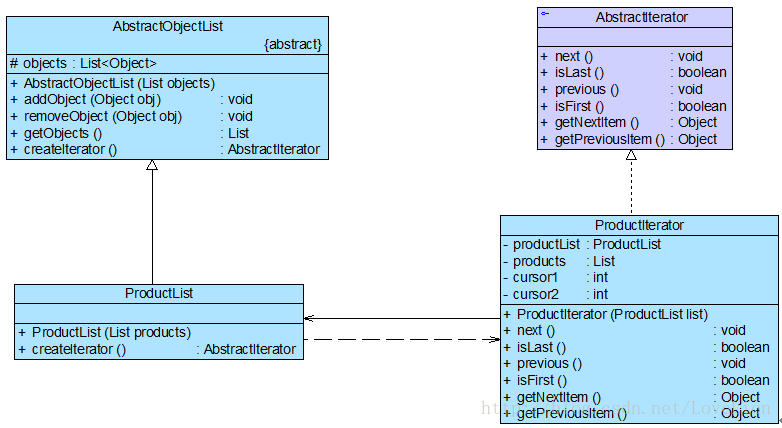

### 迭代器模式

**资料来源：**
[刘伟CSDN博客-模式](https://blog.csdn.net/lovelion/article/details/9992005)  

**核心简介：**
1. 将聚合类中负责遍历数据的方法提取出来，封装到专门的类中，
2. 实现数据存储和**数据遍历**分离，无须暴露聚合类的内部属性即可对其进行操作

**个人理解：**
1. Aggregate和Iterator相互包含，并在使用时相互调用

**UML图**  



**举例应用：**



**代码实现：**

客户端测试代码如下：
```java
class Client {
	public static void main(String args[]) {
		List products = new ArrayList();
		products.add("倚天剑");
		products.add("屠龙刀");
		products.add("断肠草");
		products.add("葵花宝典");
		products.add("四十二章经");
			
		AbstractObjectList list;
		AbstractIterator iterator;
		
		list = new ProductList(products); //创建聚合对象
		iterator = list.createIterator();	//创建迭代器对象
		
		System.out.println("正向遍历：");	
		while(!iterator.isLast()) {
			System.out.print(iterator.getNextItem() + "，");
			iterator.next();
		}
		System.out.println();
		System.out.println("-----------------------------");
		System.out.println("逆向遍历：");
		while(!iterator.isFirst()) {
			System.out.print(iterator.getPreviousItem() + "，");
			iterator.previous();
		}
	}
}
```
AbstractObjectList充当抽象聚合类，ProductList充当具体聚合类，AbstractIterator充当抽象迭代器，ProductIterator充当具体迭代器。

```java
//在本实例中，为了详细说明自定义迭代器的实现过程，我们没有使用JDK中内置的迭代器，事实上，JDK内置迭代器已经实现了对一个List对象的正向遍历
import java.util.*;
 
//抽象聚合类
abstract class AbstractObjectList {
	protected List<Object> objects = new ArrayList<Object>();
 
	public AbstractObjectList(List objects) {
		this.objects = objects;
	}
	
	public void addObject(Object obj) {
		this.objects.add(obj);
	}
	
	public void removeObject(Object obj) {
		this.objects.remove(obj);
	}
	
	public List getObjects() {
		return this.objects;
	}
	
    //声明创建迭代器对象的抽象工厂方法
	public abstract AbstractIterator createIterator();
}
 
//商品数据类：具体聚合类
class ProductList extends AbstractObjectList {
	public ProductList(List products) {
		super(products);
	}
	
    //实现创建迭代器对象的具体工厂方法
	public AbstractIterator createIterator() {
		return new ProductIterator(this);
	}
} 
 
//抽象迭代器
interface AbstractIterator {
	public void next(); //移至下一个元素
	public boolean isLast(); //判断是否为最后一个元素
	public void previous(); //移至上一个元素
	public boolean isFirst(); //判断是否为第一个元素
	public Object getNextItem(); //获取下一个元素
	public Object getPreviousItem(); //获取上一个元素
}
 
//商品迭代器：具体迭代器
class ProductIterator implements AbstractIterator {
	private ProductList productList;
	private List products;
	private int cursor1; //定义一个游标，用于记录正向遍历的位置
	private int cursor2; //定义一个游标，用于记录逆向遍历的位置
	
	public ProductIterator(ProductList list) {
		this.productList = list;
		this.products = list.getObjects(); //获取集合对象
		cursor1 = 0; //设置正向遍历游标的初始值
		cursor2 = products.size() -1; //设置逆向遍历游标的初始值
	}
	
	public void next() {
		if(cursor1 < products.size()) {
			cursor1++;
		}
	}
	
	public boolean isLast() {
		return (cursor1 == products.size());
	}
	
	public void previous() {
		if (cursor2 > -1) {
			cursor2--;
		}
	}
	
	public boolean isFirst() {
		return (cursor2 == -1);
	}
	
	public Object getNextItem() {
		return products.get(cursor1);
	} 
		
	public Object getPreviousItem() {
		return products.get(cursor2);
	} 	
}
```

编译并运行程序，输出结果如下：
> 正向遍历：
> 倚天剑，屠龙刀，断肠草，葵花宝典，四十二章经，
> 
> 逆向遍历：
> 四十二章经，葵花宝典，断肠草，屠龙刀，倚天剑，

**开发中的应用场景：**
1. JDK内置的迭代器（List/Set）

----

[回到目录](设计模式目录.md)