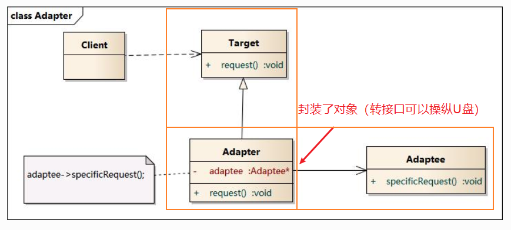

### 适配器模式adapter

**个人理解：**
1. 客户端的使用：
	- 你要使用适配器模式，需要new一个Adatee类（即U盘类）
	- 然后再new一个Adater类（转接口类）；这样子你就可以通过“操控转接口”从而间接操控“U盘类了”
2. 底层实现：
	- Adater是Target的实现类，因此可以直接 Target * tar = new Adapter(adatee);
	- Adaptee是Adapter的内部类，因此Adapter可以操控内部的Adaptee，在外部看起来就好像是用接口口可以读取U盘的数据了

**UML图**


**代码**
```java
#include <iostream>
#include "Adapter.h"
#include "Adaptee.h"
#include "Target.h"

using namespace std;

int main(int argc, char *argv[])
{
	Adaptee * adaptee  = new Adaptee(); //可以理解为U盘类
	Target * tar = new Adapter(adaptee); //可以理解为转接口类，内含了U盘类对象
	tar->request(); //因为内含了转接口类，这个时候就可以通过转接口操控U盘了
	
	return 0;
}

///////////////////////////////////////////////////////////
//  Adapter.h
//  Implementation of the Class Adapter
//  Created on:      03-十月-2014 17:32:00
//  Original author: colin
///////////////////////////////////////////////////////////

#if !defined(EA_BD766D47_0C69_4131_B7B9_21DF78B1E80D__INCLUDED_)
#define EA_BD766D47_0C69_4131_B7B9_21DF78B1E80D__INCLUDED_

#include "Target.h"
#include "Adaptee.h"

class Adapter : public Target
{

public:
	Adapter(Adaptee *adaptee);
	virtual ~Adapter();

	virtual void request();

private:
	Adaptee* m_pAdaptee;

};
#endif // !defined(EA_BD766D47_0C69_4131_B7B9_21DF78B1E80D__INCLUDED_)

///////////////////////////////////////////////////////////
//  Adapter.cpp
//  Implementation of the Class Adapter
//  Created on:      03-十月-2014 17:32:00
//  Original author: colin
///////////////////////////////////////////////////////////

#include "Adapter.h"

Adapter::Adapter(Adaptee * adaptee){
	m_pAdaptee =  adaptee;
}

Adapter::~Adapter(){

}

void Adapter::request(){
	m_pAdaptee->specificRequest();
}

///////////////////////////////////////////////////////////
//  Adaptee.h
//  Implementation of the Class Adaptee
//  Created on:      03-十月-2014 17:32:00
//  Original author: colin
///////////////////////////////////////////////////////////

#if !defined(EA_826E6B4F_12BE_4609_A0A3_95BD5E657D36__INCLUDED_)
#define EA_826E6B4F_12BE_4609_A0A3_95BD5E657D36__INCLUDED_

class Adaptee
{

public:
	Adaptee();
	virtual ~Adaptee();

	void specificRequest();

};
#endif // !defined(EA_826E6B4F_12BE_4609_A0A3_95BD5E657D36__INCLUDED_)

```

**使用场景：**
1. 经常用来做旧系统的改造和升级
2. java.io.InputStreamReader(InputStream)

----

[回到目录](设计模式目录.md)